<div align="center">

# FinVault · Data Engineering

### From a double-entry ledger to a tested star schema, orchestrated by Airflow and operated from inside the app.

[](data-pipeline/airflow_home/dags/finvault_pipeline_dag.py)
[](data-pipeline/local/run_pipeline.py)
[](#-the-lakehouse-delta-lake)
[](data-pipeline/dbt/finvault/README.md)
[](#-the-warehouse-dbt--duckdb)
[](#-the-source-a-ledger-with-rules)
[](docs/benchmarks/README.md)

<br/>

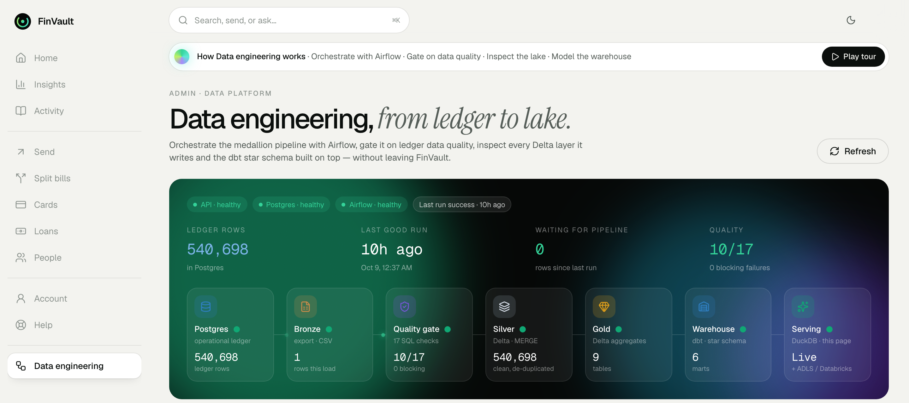

<sub>The admin <b>Data engineering</b> page. Health and freshness at the top, and the whole pipeline as a live lineage strip coloured by the latest Airflow run.</sub>

</div>

---

## In one minute

FinVault is a fintech wallet I built end to end: payments, cards, loans, a support desk. Every money movement lands in a **PostgreSQL double-entry ledger**. This page is about what happens to that data next.

1. **Apache Airflow** runs a five-task pipeline every night.
2. It **extracts** new ledger rows incrementally, then runs **17 SQL data-quality checks**. If a *blocking* check fails, the run stops before bad data can spread.
3. **PySpark** cleans the data and loads it into **Delta Lake** with an idempotent `MERGE`, then builds Gold aggregates.
4. **dbt** models a tested **star schema** with an **SCD Type 2** customer dimension in **DuckDB**.
5. An **admin console inside the app** operates all of it: trigger runs, follow tasks live, read logs, retry, inspect failing rows, browse every Delta version and explore the warehouse lineage.
6. I then **benchmarked it on synthetic ledgers of up to 20 million rows** to see where each design choice wins, and where it doesn't.

<table>
<tr>
<td align="center"><b>540,698</b><br/><sub>ledger rows in the demo</sub></td>
<td align="center"><b>5</b><br/><sub>Airflow tasks, daily</sub></td>
<td align="center"><b>17</b><br/><sub>quality checks, 4 blocking</sub></td>
<td align="center"><b>0</b><br/><sub>duplicates on re-run</sub></td>
<td align="center"><b>27 + 1</b><br/><sub>dbt tests + warning</sub></td>
<td align="center"><b>25×</b><br/><sub>MERGE vs rewrite at 20M rows</sub></td>
</tr>
</table>

---

## Contents

- [Architecture](#-architecture)
- [A tour of the console](#-a-tour-of-the-console)
- [The source: a ledger with rules](#-the-source-a-ledger-with-rules)
- [Orchestration: Apache Airflow](#-orchestration-apache-airflow)
- [Data quality: a gate, not a report](#-data-quality-a-gate-not-a-report)
- [The lakehouse: Delta Lake](#-the-lakehouse-delta-lake)
- [The warehouse: dbt + DuckDB](#-the-warehouse-dbt--duckdb)
- [Benchmarks at scale](#-benchmarks-at-scale)
- [Engineering decisions](#-engineering-decisions)
- [What broke and what I learned](#-what-broke-and-what-i-learned)
- [Testing and CI](#-testing-and-ci)
- [Path to production](#-path-to-production)
- [Run it yourself](#-run-it-yourself)
- [Where things live](#-where-things-live)

---

## 🏗 Architecture

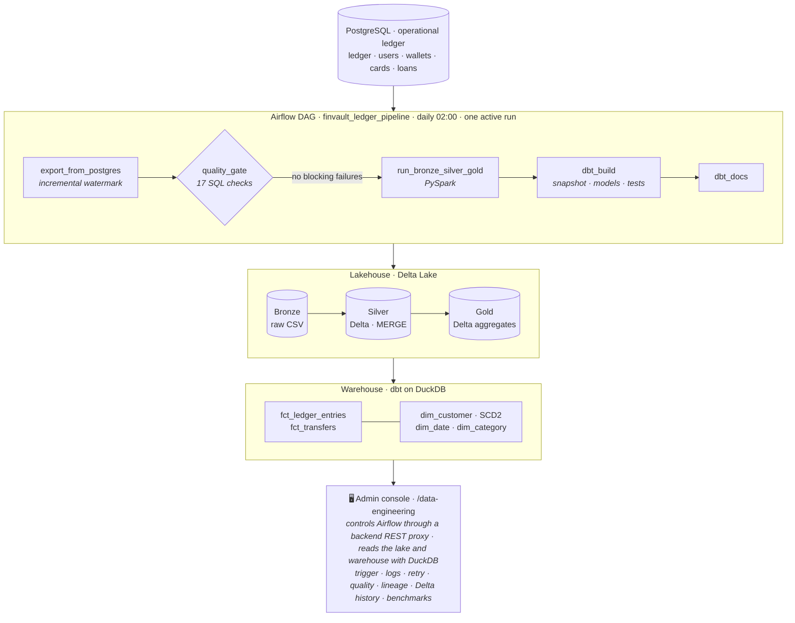

| Layer | What lives there | Format |
|---|---|---|
| **Source** | The operational ledger: one row per leg, with a running balance | PostgreSQL |
| **Bronze** | Raw incremental extracts plus customer and wallet snapshots | CSV, as landed |
| **Silver** | Cleaned, typed, de-duplicated ledger, kept up to date with `MERGE` | Delta Lake |
| **Gold** | Monthly, category, event and per-customer aggregates | Delta Lake |
| **Warehouse** | Star schema: facts, SCD2 customer, date and category dimensions | DuckDB, built by dbt |
| **Serving** | The admin console reads Delta and the warehouse in place | DuckDB |

The same Spark transforms also run as **Azure Databricks** jobs writing to **ADLS Gen2** ([`docs/databricks.md`](docs/databricks.md)). The local stack is the same pipeline, run on a laptop.

---

## 🖥 A tour of the console

Everything below is one page in the app, visible only to admins (customers get `403` on every endpoint). The backend proxies Airflow's REST API, so the browser never sees Airflow's credentials.

### The page explains itself

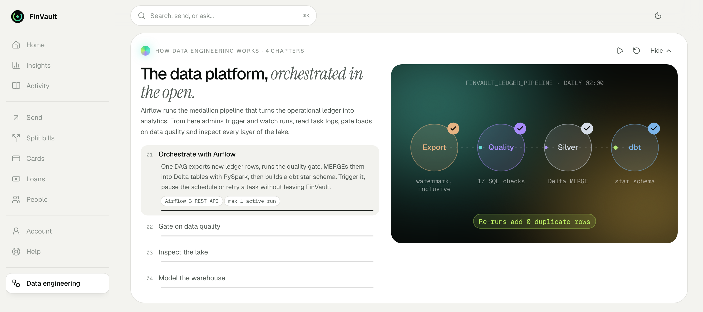

Each page in FinVault opens with an animated tour. This one walks through four chapters: **orchestrate with Airflow → gate on data quality → inspect the lake → model the warehouse**. Above, chapter 1 shows the DAG's stages. Below, chapter 3 shows the live size of each lake layer.

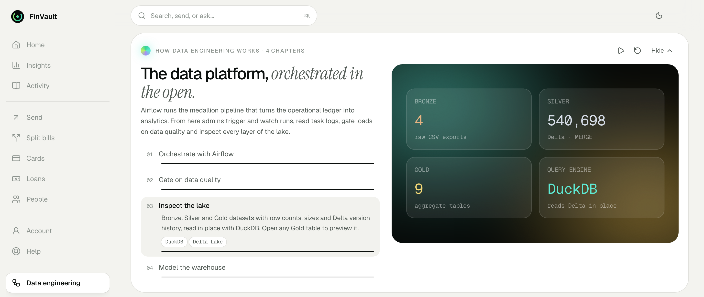

### Operate Airflow without leaving the app

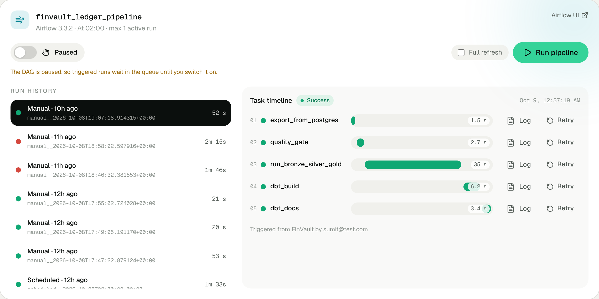

- **Pause or schedule** the DAG, and **Run pipeline** on demand. Tick **Full refresh** to rebuild Silver from scratch.
- **Run history** lists every run with its state and duration.
- The **task timeline** draws each task as a bar (Gantt style) and updates every few seconds while a run is live.
- **Retry** clears a task and everything after it, so it re-runs from that point. Each run carries a note saying which admin triggered it.

### Read task logs in place

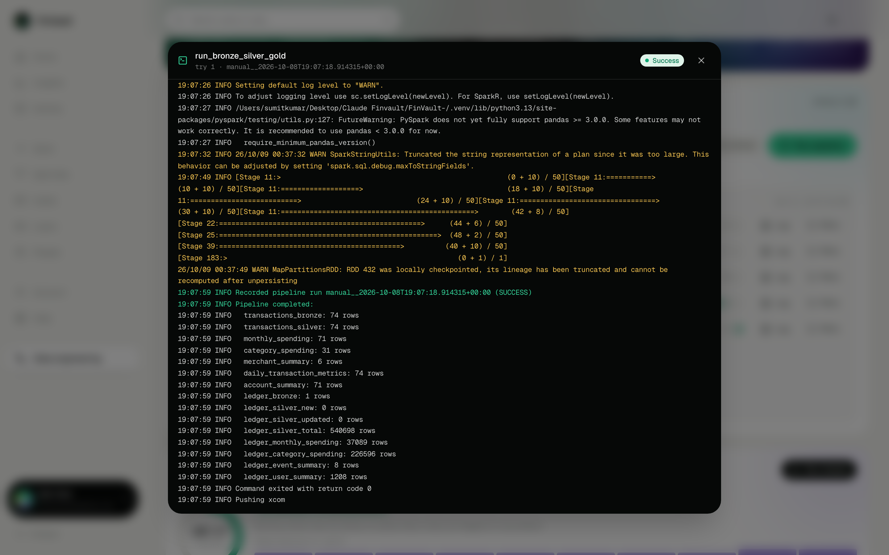

Logs come from Airflow's log API as structured events and are shown colour-coded. The Spark task's log ends with its row counts: here `ledger_bronze: 1`, `ledger_silver_new: 0`. That's idempotency you can see: the run re-read one boundary row and added nothing.

### Data quality, with the failing rows

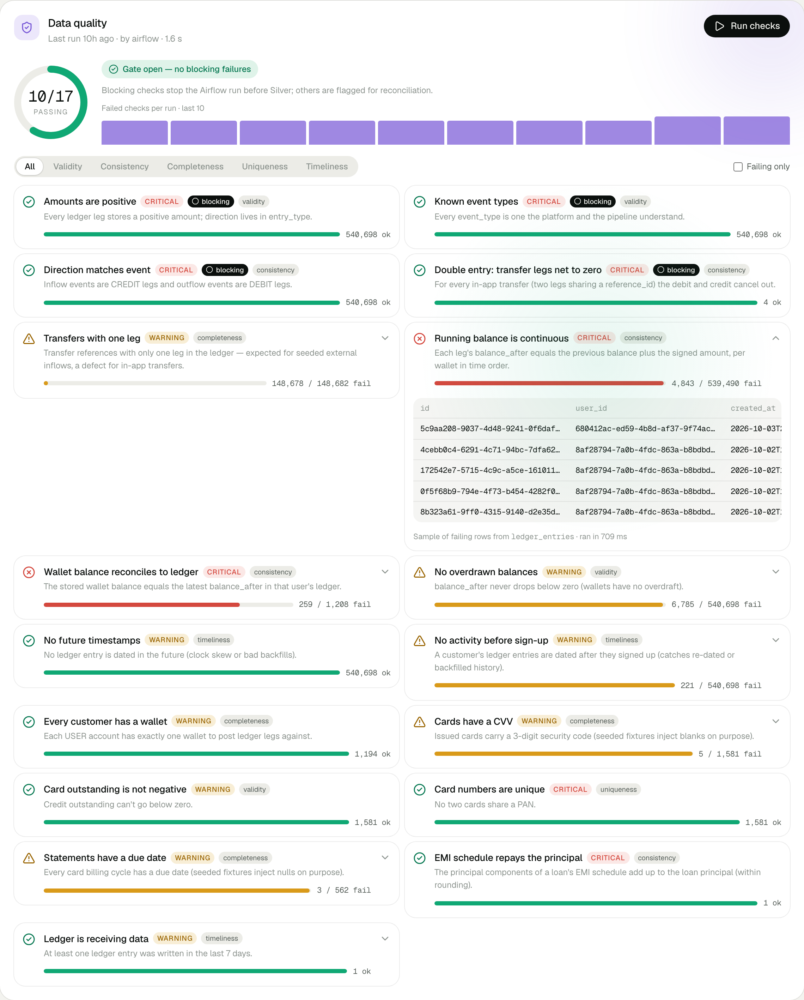

- The ring shows **10 of 17 checks passing**, and the gate status shows **open, with no blocking failures**.
- The bars show how many checks failed in each of the last 10 runs.
- Every check is tagged with a **severity**, a **dimension** and whether it's **blocking**.
- Expanding a failing check shows sample rows straight from Postgres. Here, 4,843 running-balance breaks.

### The warehouse as a living lineage graph

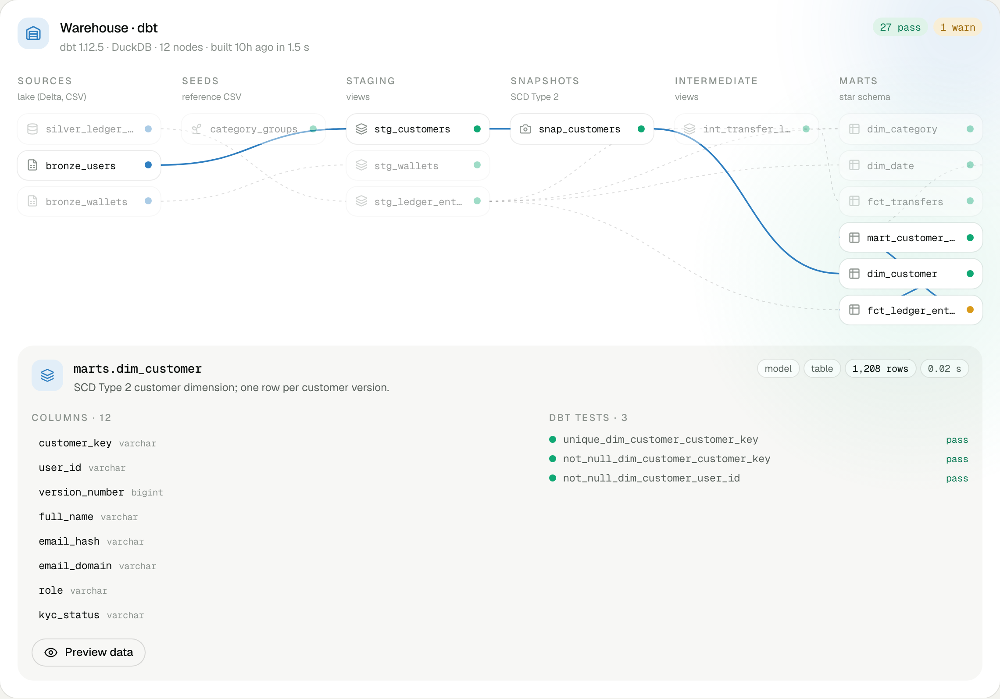

- The graph is built from dbt's `manifest.json`, laid out **sources → seeds → staging → snapshots → intermediate → marts**.
- Selecting a model highlights everything upstream and downstream of it. Here that's `dim_customer`, fed by `bronze_users → stg_customers → snap_customers`.
- The details below the graph show its description, row count, column types (from `catalog.json`), its dbt test results and a data preview.

### Pipeline runs: idempotency at a glance

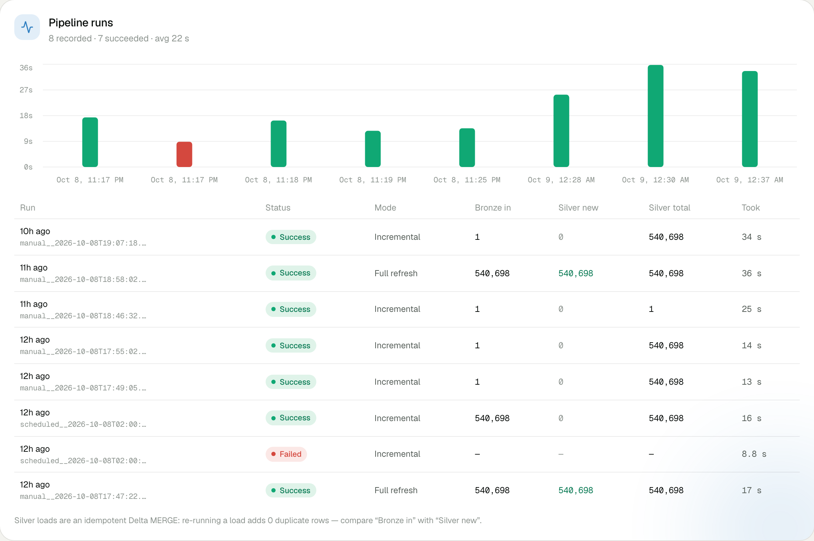

Every run writes a row to a `pipeline_runs` control table. Compare **Bronze in** with **Silver new**. A full refresh loads 540,698 rows. Incremental runs re-read a boundary row and add **0**. The one red bar is a real incident, explained [below](#-what-broke-and-what-i-learned).

### The lakehouse, version by version

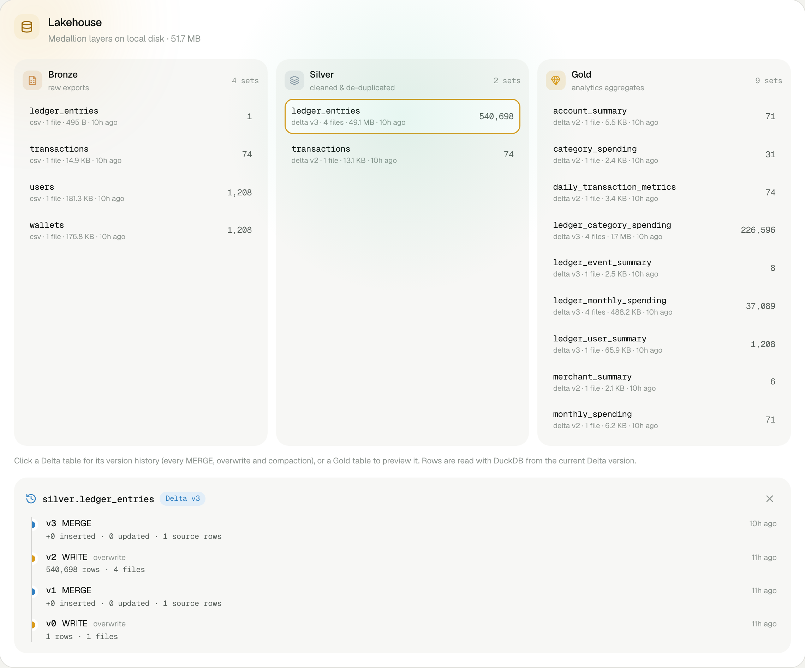

- Every dataset in **Bronze, Silver and Gold** shows its format and Delta version, file count, size, rows and freshness.
- Clicking a Delta table replays its `_delta_log` to show its history: every `MERGE` (with rows inserted and updated), overwrite and compaction.
- Clicking a Gold table previews it with DuckDB.

### Benchmarks, in the product

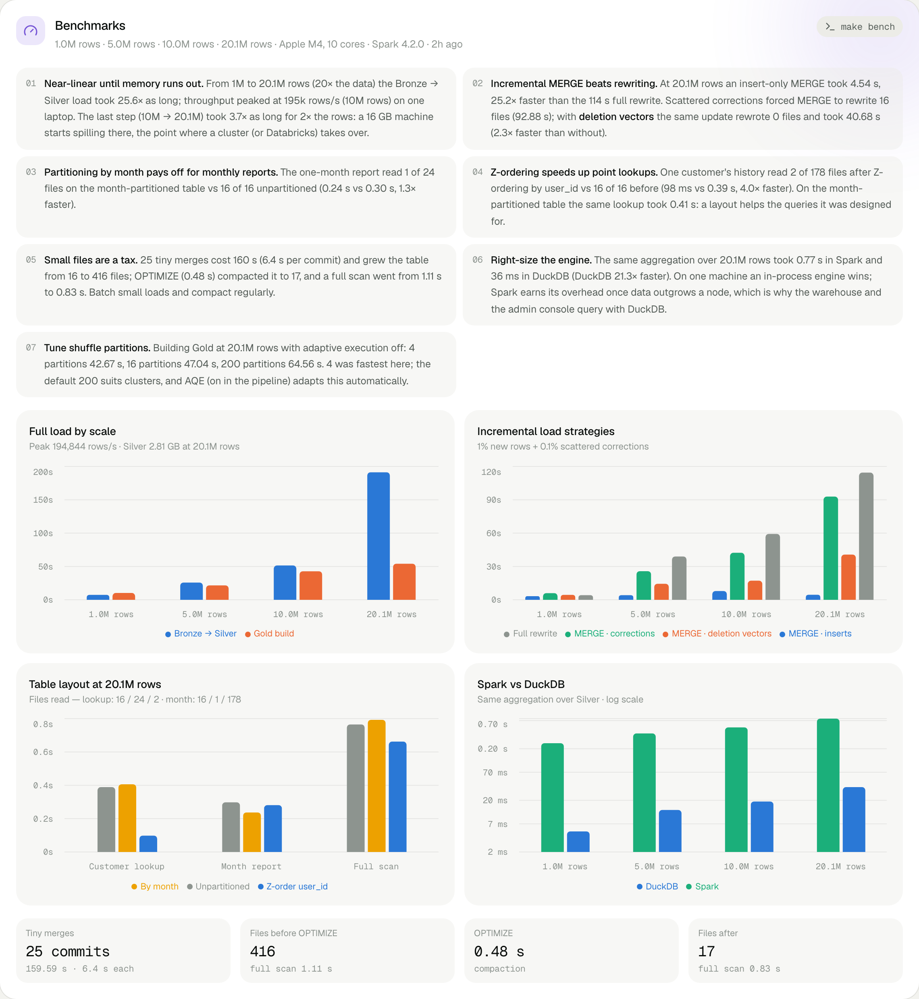

The latest benchmark run, charted. Each finding's wording is generated from the measured numbers, so it can't claim more than the run showed. Details are in [Benchmarks at scale](#-benchmarks-at-scale).

---

## 💳 The source: a ledger with rules

The ledger in Postgres has one row per **leg**:

| Column | Meaning |
|---|---|
| `entry_type` | `DEBIT` or `CREDIT`. `amount` is always positive; the direction lives here. |
| `event_type` | `TOP_UP`, `TRANSFER_IN/OUT`, `EXPENSE`, `SPLIT_*`, `LOAN_*`, `OPENING_BALANCE` |
| `reference_id` | Shared by the two legs of a transfer |
| `balance_after` | The wallet's running balance after this leg |

That structure carries rules you can test, and that is what makes the quality gate meaningful rather than a list of null checks:

- **Double entry:** a transfer's two legs net to zero.
- **Running balance:** the previous balance plus the signed amount equals the new balance, wallet by wallet in time order.
- **Reconciliation:** each wallet's stored balance equals the latest `balance_after` in its ledger.

---

## 🌬 Orchestration: Apache Airflow

```python
with DAG(
    dag_id="finvault_ledger_pipeline",
    schedule="0 2 * * *",          # daily at 02:00
    max_active_runs=1,              # runs share one lake, so never overlap
    default_args={"retries": 2, "on_failure_callback": alert_on_failure},
    ...
):
    export_task >> quality_gate >> run_pipeline_task >> dbt_build >> dbt_docs
```

| Task | What it does | Why it matters |
|---|---|---|
| `export_from_postgres` | Pulls ledger rows since the last watermark (`created_at >=`), plus customer and wallet snapshots | Incremental. The inclusive boundary never skips same-timestamp or late rows. |
| `quality_gate` | Runs the 17 checks and records the results; exits non-zero only on **blocking** failures | Bad data stops here, before it reaches Silver |
| `run_bronze_silver_gold` | PySpark: clean and de-duplicate, `MERGE` into Silver, rebuild Gold | Idempotent ACID loads with version history |
| `dbt_build` | Seeds, SCD2 snapshot, models and tests | Modeled, tested warehouse |
| `dbt_docs` | Regenerates the dbt catalog and lineage | Feeds the console's warehouse graph |

**How each task gets its context:**
- Each task receives the Airflow `run_id`, so quality results and run metrics trace back to the DAG run that produced them.
- `{"full_refresh": true}` in the run config rebuilds Silver from scratch.
- Every task runs the **same module you'd run by hand**, so there's no logic hidden in the DAG file.

**How the app talks to Airflow:**
- The backend uses Airflow 3's REST API (`/api/v2`) with a JWT from `/auth/token`. The token is cached and refreshed when it expires.
- If Airflow is down, the console shows an *offline* state instead of erroring.

---

## 🛡 Data quality: a gate, not a report

17 checks, each with a **dimension**, a **severity**, a **blocking** flag and a query that pulls sample failing rows:

| Dimension | Checks (blocking in **bold**) |
|---|---|
| Validity | **positive amounts** · **known event types** · no overdrawn balances · card outstanding ≥ 0 |
| Consistency | **direction matches event** · **transfer legs net to zero** · running-balance continuity · wallet ↔ ledger reconciliation · EMI schedule repays the principal |
| Completeness | single-leg transfers · every customer has a wallet · cards have a CVV · statements have a due date |
| Uniqueness | card numbers are unique |
| Timeliness | no future timestamps · no activity before sign-up · the ledger is receiving data |

**Severity and blocking are separate decisions.** Structural corruption (impossible amounts, unknown events, unbalanced transfers) makes every downstream number wrong, so it **blocks**. Known historical issues are real but shouldn't halt delivery, so they're **flagged** and reconciled.

**What the checks found in the demo data:**

| Finding | Count | Root cause |
|---|---|---|
| Running-balance breaks | **4,843** across 253 wallets | A seed script re-dated history without recomputing balances |
| Wallets not reconciling to the ledger | **259** | Same cause |
| Activity before sign-up | **221** | Same cause. dbt flags the same rows as a warning, so two independent layers agree. |
| Single-leg transfers | 148,678 | Expected: seeded money arriving from outside the system |
| In-app transfers that don't balance | **0** | Double entry holds where the app writes both legs |

Run the checks from the console, with `make quality`, or in every DAG run. Results go to a `data_quality_runs` control table.

---

## 🌊 The lakehouse: Delta Lake

Silver is loaded with a **`MERGE`**, which makes every load idempotent:

```python
target.alias("t").merge(increment.alias("s"), "t.ledger_entry_id = s.ledger_entry_id") \
    .whenMatchedUpdateAll(condition=changed)   # a correction at the source: update in place
    .whenNotMatchedInsertAll()                 # a new leg: insert
    .execute()                                 # a re-read or retried leg: matches, nothing changes
```

| Situation | What happens |
|---|---|
| New ledger leg | Inserted |
| Corrected leg (same id, new values) | Updated in place |
| Re-read boundary row, or a retried run | Matches and changes nothing: **0 duplicates** |
| Readers during a load | See the old version or the new one, never half of each (ACID) |

- **Every write is a version.** The console replays `_delta_log` to show each table's history, without Spark.
- **Compaction is automatic.** Each `MERGE` adds small files, so the table is compacted with `OPTIMIZE` once it has more than 16.
- **Serving needs no Spark.** DuckDB reads the current Delta version in place (`delta_scan`) for counts and previews.
- **Migrated from Parquet.** The first Delta write replaces the old Parquet folders automatically.

---

## 🧱 The warehouse: dbt + DuckDB

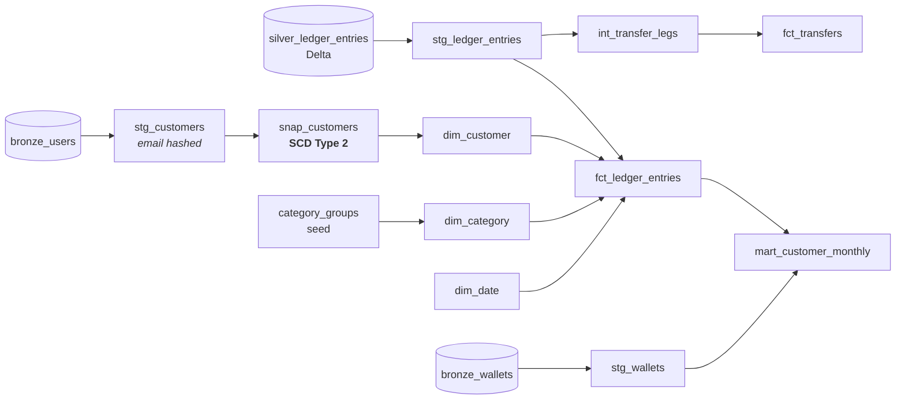

- **Star schema.**
  - Facts at a declared grain: one ledger leg, and one transfer.
  - Dimensions for customer version, date and category, linked by surrogate keys.
- **SCD Type 2 customers.**
  - A dbt snapshot versions each customer when their KYC status, role or name changes.
  - Facts join to **the version that was true at transaction time**.
  - Each customer's first version is open-ended back to 1900. Older history still finds a customer, and the source issue is reported by a warning test rather than dropped.
- **PII stays out of the marts.** Emails become a hash plus a domain in staging.
- **27 tests:**
  - generic: unique, not null, accepted values, relationships
  - a custom composite-key test
  - a singular double-entry test
  - one warning-level source-data test
- **The console reads dbt's artifacts.** It uses `manifest.json`, `catalog.json` and the build results, and opens DuckDB read-only.

More: [`data-pipeline/dbt/finvault/README.md`](data-pipeline/dbt/finvault/README.md).

---

## 📈 Benchmarks at scale

The benchmarks used synthetic ledgers of **1M, 5M, 10M and 20M rows** with:
- skewed customers (the top 1% make about 10% of entries)
- log-normal amounts per category
- month-end salaries
- paired transfers and correct running balances

The data is generated in Spark, deterministic per seed, and validated before use: 0 unbalanced transfers, 0 balance breaks, 0 duplicate IDs. It runs through the **production code** on a separate lake.

**Highlights at 20M rows** (Apple M4, 16 GB, Spark local):

| Experiment | Result |
|---|---|
| Insert-only `MERGE` vs rewriting Silver | **4.5 s vs 114 s**: 25× faster |
| Scattered corrections, with vs without **deletion vectors** | **41 s vs 93 s**, with 0 files rewritten instead of 16 |
| Customer lookup after **Z-ordering** by `user_id` | Read **2 of 178 files**: 0.10 s vs 0.39 s |
| One-month report on a **month-partitioned** table | Read 1 of 24 files: 0.24 s vs 0.30 s |
| 25 tiny merges, then `OPTIMIZE` | **416 files → 17**; full scan 1.11 s → 0.83 s |
| The same aggregation: Spark vs DuckDB | 0.77 s vs **36 ms** |

<details>
<summary><b>All four scales</b></summary>

| Rows | Bronze → Silver | Throughput | `MERGE` inserts | `MERGE` + corrections | + deletion vectors | Full rewrite | DuckDB | Spark |
|---|---|---|---|---|---|---|---|---|
| 1.0M | 7.5 s | 134k rows/s | 3.2 s | 6.0 s | 4.4 s | 4.2 s | 5 ms | 0.26 s |
| 5.0M | 25.9 s | 194k rows/s | 4.2 s | 25.8 s | 14.4 s | 39.0 s | 13 ms | 0.40 s |
| 10.0M | 51.5 s | 195k rows/s | 7.9 s | 42.3 s | 17.2 s | 59.3 s | 19 ms | 0.52 s |
| 20.1M | 191.3 s | 105k rows/s | 4.5 s | 92.9 s | 40.7 s | 114.4 s | 36 ms | 0.77 s |

</details>

**Where it didn't win, reported as measured:**
- At 1M rows a full rewrite is still slightly cheaper than `MERGE`; fixed overhead dominates at that size.
- Partitioning by month *slowed* customer lookups. A layout only helps the queries it was designed for.
- Going from 10M to 20M rows took 3.7× as long for 2× the data. The 16 GB machine starts spilling to disk, which is the point where a cluster takes over.

Full method, every chart and the raw JSON: [`docs/benchmarks/README.md`](docs/benchmarks/README.md).

---

## 🧭 Engineering decisions

| Decision | Why | Trade-off I accepted |
|---|---|---|
| Inclusive watermark (`>=`) plus `MERGE` | `>` silently loses rows that share the watermark's timestamp. Overlap plus an idempotent load gives exactly-once results. | One boundary row is re-read each run (and changes nothing) |
| Blocking vs flagged checks | Stop on corruption, keep delivering through known issues | Flagged issues need a reconciliation process |
| Delta `MERGE` over Parquet appends | Upserts, ACID commits, time travel; corrections become possible | Small files, so compaction is needed |
| Gold fully recomputed | Correct by construction; cheap at this size | Would move to an incremental `MERGE` per partition at scale |
| `max_active_runs=1` | Runs share one local lake | No overlapping runs; per-run paths would remove this |
| DuckDB for serving and the warehouse | In-process, 21× faster than Spark on one machine | Single node; a cloud warehouse for concurrency |
| Backend proxy for Airflow | Keeps credentials server-side; role checks in one place | One more hop |
| SCD2 snapshot with an open-ended first version | Facts keep a valid customer even before the first snapshot | A warning test surfaces source-data issues instead of hiding them |

---

## 🔧 What broke and what I learned

Real incidents from building this, each found, fixed and covered by a test or a guard.

<details open>
<summary><b>Overlapping runs clobbered the lake</b></summary>

Switching the DAG on immediately scheduled the day's run, *alongside* my manual run. Both wrote the same folders, and one failed (the red bar in the runs chart). **Fix:** `max_active_runs=1`. **Lesson:** shared mutable storage needs one writer at a time, or isolation per run.
</details>

<details>
<summary><b>A unit test was quietly overwriting the real lake</b></summary>

A legacy test ran the pipeline against the default paths. Harmless, until the Delta migration made it destructive: real Silver dropped to 1 row. I spotted it in the table's Delta history (a 1-row WRITE I hadn't made). **Fix:** an autouse fixture that sends every test to a temporary lake, then a full refresh from Postgres. **Lesson:** tests must be hermetic, and it's worth designing derived data so it can be rebuilt from the source.
</details>

<details>
<summary><b>Seed data had broken history: found by the quality gate</b></summary>

4,843 running-balance breaks, 259 unreconciled wallets and 221 entries before sign-up, all traced to a script that re-dated history without recomputing balances. Flagged rather than blocking, root-caused, and checked in two layers (SQL gate + dbt).
</details>

<details>
<summary><b>The SCD2 join dropped 221 facts</b></summary>

The first snapshot's `valid_from` was the snapshot time, so older transactions found no customer version. **Fix:** make each customer's first version open-ended, plus a warning test that reports the underlying data issue.
</details>

<details>
<summary><b>Smaller ones</b></summary>

- **Spark workers started the wrong Python** (3.15 vs 3.13). Fixed by pinning `PYSPARK_PYTHON` to the driver's interpreter.
- **`dbt docs generate` overwrote the build results.** The DAG now keeps a copy for the console.
- **Counting Parquet files in a Delta folder over-counts**, because old versions' files stay on disk. The console now reads through `delta_scan` and replays the log.
- **My first benchmark was unfair to `MERGE` and to partitioning.** I redesigned it: repartition before partitioned writes, a production-like file size, three `MERGE` variants. The report's wording now follows the measured direction of each result.
</details>

---

## ✅ Testing and CI

| Suite | Result | Highlights |
|---|---|---|
| Backend | **104 passed** | Customers get 403 on every endpoint; the checks catch a broken balance (non-blocking) and an unknown event type (blocking); Airflow offline is handled; Delta log replay; path-traversal guard |
| Data pipeline | **23 passed** | Re-running a load adds 0 rows; `MERGE` applies corrections in place; generator rules and determinism; report wording follows the numbers |
| dbt | **27 pass + 1 warn** | Keys, relationships, accepted values, composite keys, double entry |
| Frontend | type-check + build | `tsc -b`, `vite build` |

GitHub Actions runs the backend tests against Postgres, the pipeline tests on Java 17 and `dbt parse`, and builds the frontend.

---

## 🚀 Path to production

| Here | In production |
|---|---|
| Watermark polling | **CDC** (Debezium → Kafka → Spark Structured Streaming) to capture updates and deletes |
| Airflow standalone, `BashOperator` | Managed Airflow (MWAA, Astronomer or Composer); Kubernetes or Databricks operators; secrets in a vault |
| Local Delta lake | ADLS Gen2 or S3 with Unity Catalog. The Databricks path already exists. |
| Gold fully recomputed | An incremental `MERGE` per partition |
| One active run | Run- or partition-scoped writes, so backfills can run in parallel |
| Failure log file | Slack or PagerDuty alerts, SLAs and OpenLineage |
| DuckDB warehouse | Snowflake, BigQuery or Databricks SQL for concurrent users |

---

## ▶ Run it yourself

Step-by-step for **macOS and Windows**: **[LOCAL_SETUP.md](LOCAL_SETUP.md)**.

Once it's set up:

```bash
make dev
```

Then open http://localhost:5173, sign in as an admin, open **Data engineering**, tick **Full refresh** and click **Run pipeline**.

| Command | What it does |
|---|---|
| `make dev` | Starts the API, Airflow and the frontend together |
| `make quality` | Runs the 17 checks |
| `make dbt` / `make dbt-docs` | Builds the warehouse / serves the dbt docs |
| `make bench` / `make bench-report` | Runs the benchmarks / re-renders the report |
| `make test-pipeline` | Runs the pipeline tests |

---

## 🗂 Where things live

| Path | Contents |
|---|---|
| [`data-pipeline/airflow_home/dags/finvault_pipeline_dag.py`](data-pipeline/airflow_home/dags/finvault_pipeline_dag.py) | The Airflow DAG |
| [`data-pipeline/local/`](data-pipeline/local/) | Export and watermark, Spark runner, Delta `MERGE`, run metrics |
| [`data-pipeline/common/transforms/`](data-pipeline/common/transforms/) | Bronze, Silver and Gold transforms (shared with Databricks) |
| [`data-pipeline/dbt/finvault/`](data-pipeline/dbt/finvault/) | dbt project: sources, seeds, snapshot, models, tests |
| [`data-pipeline/bench/`](data-pipeline/bench/) | Synthetic data generator, benchmark harness, report |
| [`backend/app/services/data_quality.py`](backend/app/services/data_quality.py) | The 17 quality checks (CLI: `app/cli/data_quality.py`) |
| [`backend/app/services/airflow_client.py`](backend/app/services/airflow_client.py) | Airflow 3 REST client |
| [`backend/app/services/data_platform.py`](backend/app/services/data_platform.py) · [`warehouse.py`](backend/app/services/warehouse.py) | Lake, Delta history, warehouse and benchmark readers |
| [`backend/app/api/routes/data_platform.py`](backend/app/api/routes/data_platform.py) | Admin API: `/api/admin/data-platform/*` |
| [`frontend/src/pages/DataEngineering.tsx`](frontend/src/pages/DataEngineering.tsx) · [`pages/data/`](frontend/src/pages/data/) | The console |
| [`docs/benchmarks/`](docs/benchmarks/README.md) | Benchmark report and raw results |

<div align="center">
<br/>
<sub>Built by <a href="https://github.com/developsumitkumar">Sumit Kumar</a> · PostgreSQL · Apache Airflow · PySpark · Delta Lake · dbt · DuckDB · FastAPI · React</sub>
</div>
