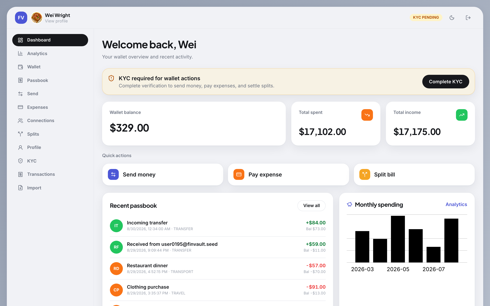
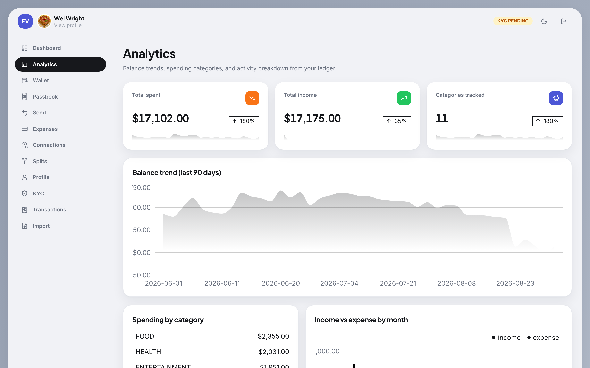
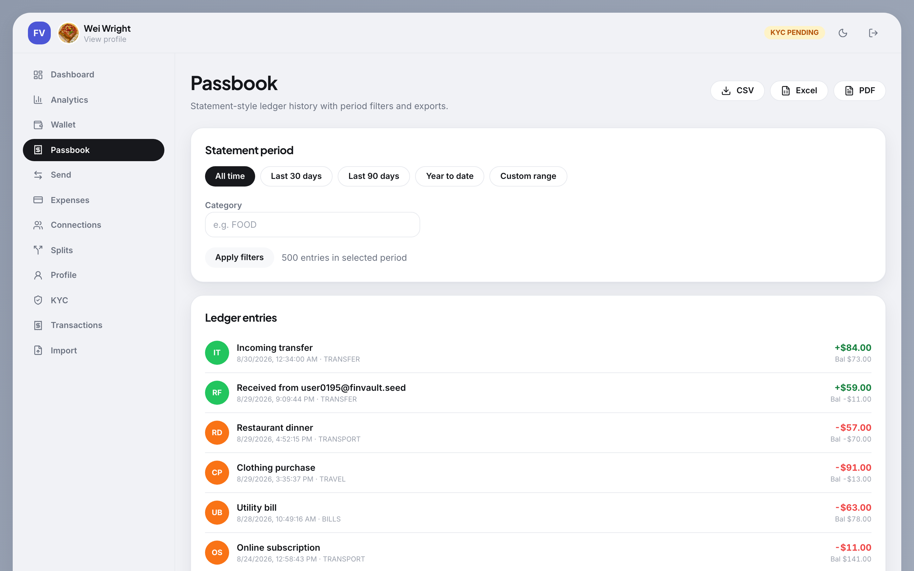
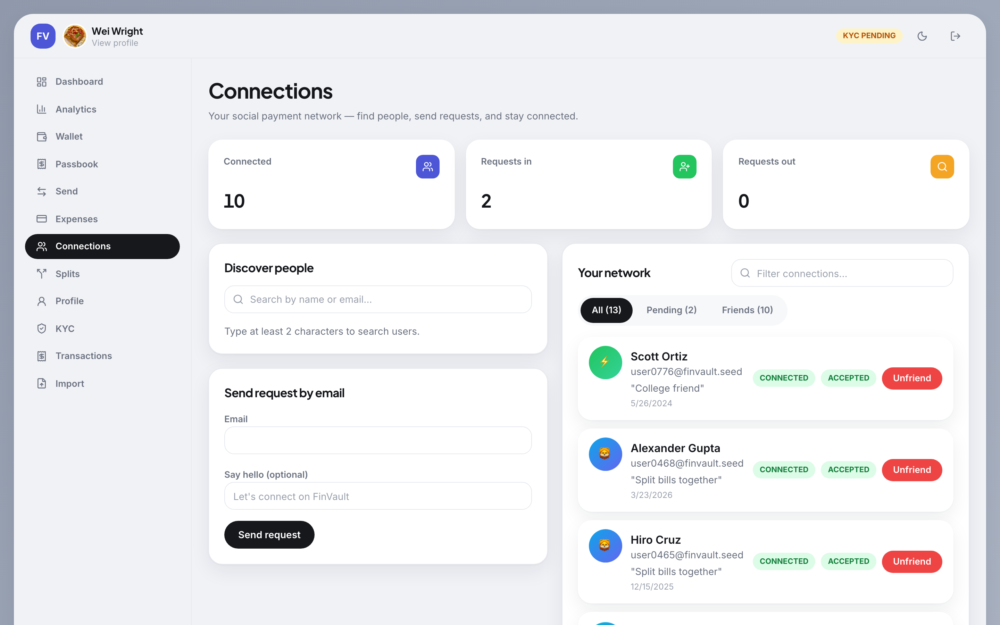
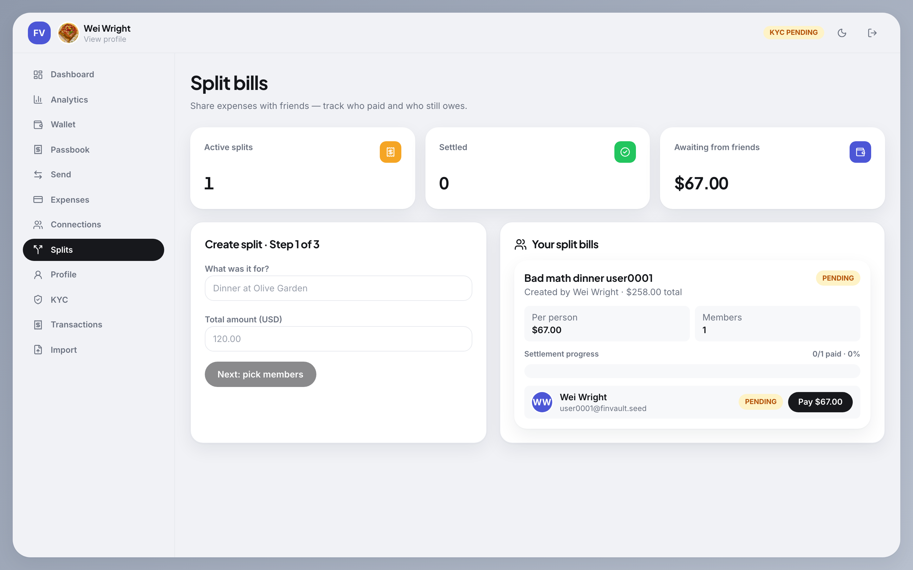
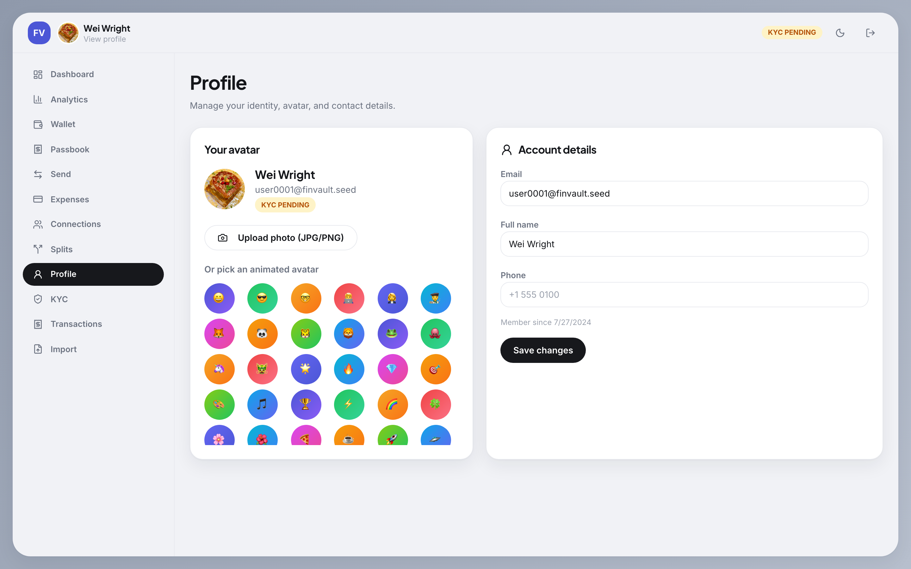
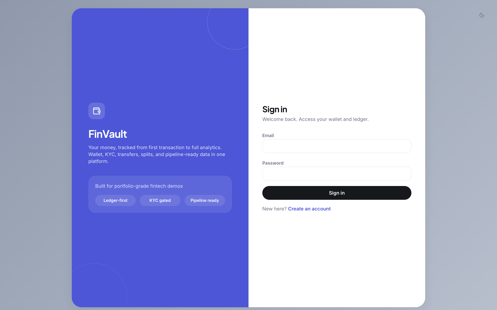
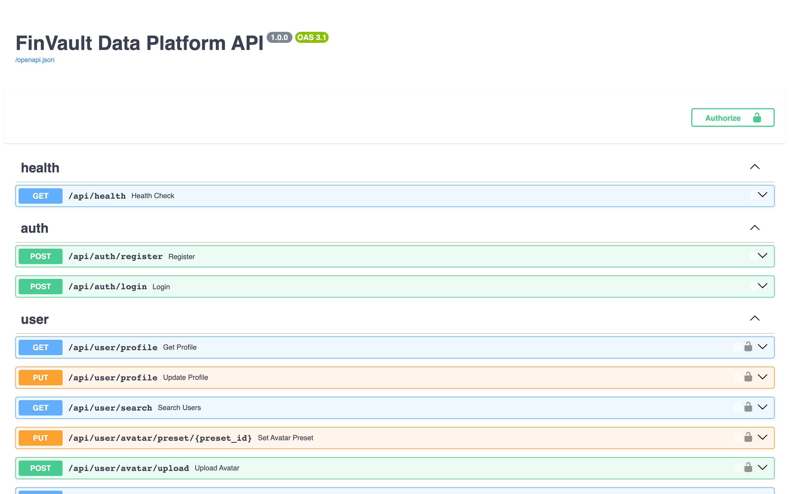
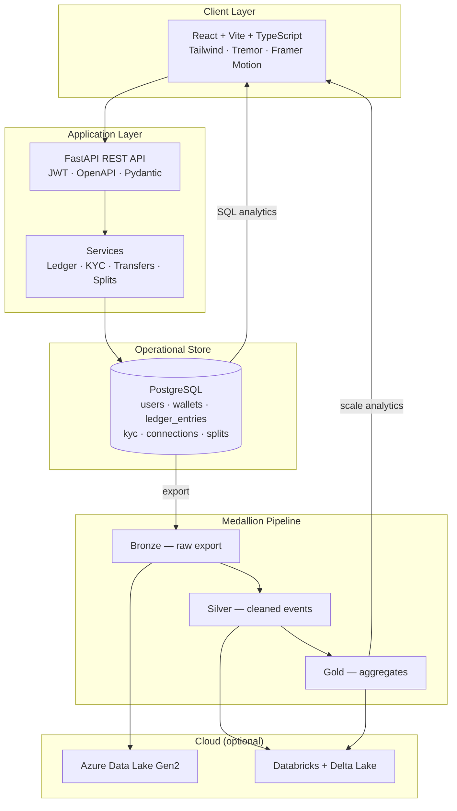

# FinVault Data Platform

**A production-style fintech wallet built in Python — paired with a medallion data pipeline that takes the same financial events from app to cloud analytics.**

> Full-stack software engineering meets data engineering in one portfolio project: real money-movement semantics (ledger, KYC, P2P transfers), a modern React product UI, and Bronze → Silver → Gold processing with PySpark, Azure, and Delta Lake.

[](.github/workflows/ci.yml)
[](backend/)
[](frontend/)
[](docs/database.md)
[](docs/data-pipeline.md)
[](data-pipeline/airflow_home/dags/finvault_pipeline_dag.py)

**Related:** Original Java/Spring Boot version — [developsumitkumar/FinVault](https://github.com/developsumitkumar/FinVault)

**Live demo:** Not deployed yet — run locally with Docker (see [Quick start](#quick-start-docker)) or follow [`docs/deployment.md`](docs/deployment.md) when you're ready to ship.

**Contributing:** See [CONTRIBUTING.md](CONTRIBUTING.md)

---

## Screenshots

<p align="center">
  
  <br />
  <em>Dashboard — wallet overview, KYC status, quick actions, and recent ledger activity</em>
</p>

<table>
  <tr>
    <td width="50%">
      
      <br />
      <sub><b>Analytics</b> — balance trend, category spending, income vs expense</sub>
    </td>
    <td width="50%">
      
      <br />
      <sub><b>Passbook</b> — statement-style filters, CSV / Excel / PDF export</sub>
    </td>
  </tr>
  <tr>
    <td width="50%">
      
      <br />
      <sub><b>Connections</b> — discover users, manage requests, social-style network</sub>
    </td>
    <td width="50%">
      
      <br />
      <sub><b>Split bills</b> — multi-step create flow and settlement tracking</sub>
    </td>
  </tr>
  <tr>
    <td width="50%">
      
      <br />
      <sub><b>Profile</b> — animated avatars, photo upload, account details</sub>
    </td>
    <td width="50%">
      
      <br />
      <sub><b>Auth</b> — split-hero login with light / dark theme</sub>
    </td>
  </tr>
</table>

<p align="center">
  
  <br />
  <em>Auto-generated API docs — full REST surface with try-it-out</em>
</p>

> To refresh screenshots after UI changes: `node scripts/capture-readme-screenshots.mjs` (see [docs/screenshots/README.md](docs/screenshots/README.md))

---

## Why this project exists

Most portfolio apps stop at CRUD. FinVault is designed to show **how fintech and data platforms work together in practice**:

| What recruiters care about | How FinVault demonstrates it |
|---|---|
| **Backend design** | Layered FastAPI (routes → services → repositories), Pydantic validation, Alembic migrations |
| **Financial correctness** | Append-only ledger, wallet row locking, atomic transfers, KYC-gated operations |
| **Product engineering** | Auth, onboarding, social connections, split bills, analytics, exports, admin workflows |
| **Data engineering** | Medallion architecture, incremental + idempotent loading, Airflow orchestration, PySpark transforms, ADLS Gen2, Databricks + Delta Lake |
| **Engineering discipline** | 55+ backend tests, pipeline tests, Docker Compose, CI, structured logging, deployment docs |

---

## System overview



**Data flow in one sentence:** users move money in the app → every event lands in an immutable ledger → exports feed Bronze/Silver/Gold → the same story is visible in real-time SQL dashboards and batch analytics at scale.

---

## Production data engineering practices

This isn't a happy-path pipeline demo — it's built and documented the way a real production pipeline gets hardened over time.

**Incremental & idempotent loading.** The export step tracks a watermark (last successfully processed timestamp) so every run only pulls new rows, not a full table scan. While building this, a real bug surfaced: skipping the Bronze file write when zero new rows arrived left a stale file on disk, which the next stage silently re-appended, duplicating data. Root-caused, fixed (always write Bronze, even empty, so "no new data" is represented truthfully), and verified with a three-run test (baseline → no-op run → run with exactly one new row). Full walkthrough: [`docs/data-pipeline-learning-notes.md`](docs/data-pipeline-learning-notes.md).

**Orchestration, not just a script.** The pipeline runs as an Apache Airflow DAG — `export → transform`, dependency-ordered, with automatic retries (exponential backoff) for transient failures and failure alerting (email / Slack webhook callback) so a broken run doesn't fail silently overnight.

**Cloud-target architecture.** The medallion layers are designed to run unchanged locally and on Azure: ADLS Gen2 for storage, Databricks for managed Spark compute, and Delta Lake for the table format (ACID transactions, `MERGE`/upsert, time travel). The ADLS upload path, Delta table schemas, and Databricks job/notebook templates are implemented and documented — see [`docs/azure-storage.md`](docs/azure-storage.md) and [`docs/databricks.md`](docs/databricks.md). Cloud deployment against a live Azure subscription is the current next milestone.

---

## Feature highlights

### Wallet & ledger
- Per-user wallet with **opening balance** on registration
- **Append-only ledger** — debits, credits, balance-after on every event
- Passbook with **category filters**, **date-range statements**, pagination, and **CSV / Excel / PDF export**
- Debit amounts styled for clarity; credits vs debits visually distinct

### Identity & compliance
- JWT authentication (register / login) with bcrypt password hashing
- **KYC document upload** (PDF, JPG, PNG) with admin approve / reject queue
- **Submission history** — rejected users can resubmit; prior records kept as audit trail
- Wallet operations gated until KYC is **APPROVED** (sender and receiver for transfers)

### Money movement
- **P2P transfers** by recipient email with dual ledger entries
- **External expense payments** with purpose and category
- **Split bills** — create group expenses, invite members, settle shares via ledger transfers
- Insufficient balance and KYC checks enforced server-side

### Social graph
- Connection requests (send, accept, reject, withdraw, unfriend)
- **User discovery search** by name or email
- Social-style connections UI with avatars, notes, and status pills

### Profile & avatars
- **Profile page** — edit name, phone, avatar
- **50 animated preset avatars** with even distribution across users
- Custom **JPG/PNG avatar upload**

### Analytics
- Real-time SQL aggregations: spending by category, monthly trends, income vs expense
- **Balance trend**, activity breakdown, stat cards with sparklines
- Tremor charts mapped to a consistent design system (`design.md`)

### Data platform
- **CSV bulk import** with validation, deduplication, and error reporting
- Local **PySpark** pipeline: Bronze → Silver → Gold, tested end-to-end
- **Incremental, idempotent loading** — watermark-based extraction; a real duplicate-row bug was found, root-caused, and fixed (see [`docs/data-pipeline-learning-notes.md`](docs/data-pipeline-learning-notes.md))
- **Apache Airflow orchestration** — DAG-scheduled runs, automatic retries with exponential backoff, and failure alerting (email / Slack)
- **Ledger export** integrated into the medallion cycle (Phase 13)
- **Azure ADLS Gen2 + Databricks + Delta Lake** — storage upload, Delta table schemas, and job/notebook templates implemented and documented; live cloud deployment is the next step
- Data quality injection scripts for realistic pipeline testing

### Platform & ops
- **Docker Compose** full stack (Postgres + API + frontend)
- GitHub Actions CI (backend tests + frontend production build)
- Structured JSON logging and request IDs in production
- Deployment guide for Render (API) + Vercel (SPA)

---

## Technology stack

| Layer | Technologies |
|---|---|
| **Frontend** | React 19, TypeScript, Vite, Tailwind CSS v4, TanStack Query, React Hook Form, Zod, Tremor, Framer Motion, Lucide |
| **Backend** | Python 3.12, FastAPI, Pydantic v2, SQLAlchemy 2, Alembic, JWT, bcrypt |
| **Database** | PostgreSQL 15 (ACID, constraints, row-level locking on wallets) |
| **Data** | PySpark, Delta Lake, pandas, Azure Data Lake Storage Gen2, Databricks |
| **Tooling** | Docker, Docker Compose, pytest, GitHub Actions, Makefile |
| **Design** | Custom fintech design system (`design.md`) — light/dark theme toggle |

---

## Quick start (Docker)

The fastest way to run the full stack:

```bash
git clone https://github.com/developsumitkumar/finvault-data-platform.git
cd finvault-data-platform
cp .env.example .env
docker compose up --build
```

| URL | Description |
|---|---|
| http://localhost:3000 | React application |
| http://localhost:8000/docs | Interactive OpenAPI (Swagger) |
| http://localhost:8000/api/health | Health check |

### Demo accounts

| Account | Email | Password | Notes |
|---|---|---|---|
| **Admin** | `sumit@test.com` | `123456` | KYC approved · Admin KYC queue |
| **Seeded user** | `user0001@finvault.seed` | `password123456` | After running `make seed-demo` |

Register a new user to walk through onboarding: wallet opens with a **$10,000** balance and an opening ledger entry.

### Rich demo dataset (optional)

Seed ~1,000 users with 5 years of ledger history, connections, and KYC variety:

```bash
make seed-demo          # full dataset
make seed-demo-small    # 10 users — quick smoke test
make backfill-avatars   # assign animated avatars to users missing one
```

---

## Local development (without Docker)

### Prerequisites

- PostgreSQL 15+
- Python 3.11+ (3.12 recommended)
- Node.js 20+
- Java 17+ (PySpark pipeline only)

### Backend

```bash
cp .env.example .env
# Start Postgres (Docker or local), then:

cd backend
python3 -m venv .venv && source .venv/bin/activate
pip install -r requirements.txt
alembic upgrade head
uvicorn app.main:app --reload --port 8000
```

### Frontend

```bash
cd frontend
npm install --legacy-peer-deps
npm run dev
```

App: http://localhost:5173 · API: http://localhost:8000/docs

### Data pipeline

```bash
export JAVA_HOME=$(/usr/libexec/java_home -v 19)   # macOS example
cd data-pipeline
python -m venv .venv && source .venv/bin/activate
pip install -r requirements.txt

python -m local.run_pipeline --export    # export DB → Bronze → Silver → Gold
python -m local.verify_ledger_cycle --fixture   # verify transforms (no DB)
```

See [`docs/data-pipeline.md`](docs/data-pipeline.md) · [`docs/databricks.md`](docs/databricks.md) · [`docs/azure-storage.md`](docs/azure-storage.md)

---

## Testing & quality

```bash
make test              # backend + frontend
make test-backend      # pytest (PostgreSQL required)
make test-frontend     # TypeScript check + production build
make test-pipeline     # PySpark transform tests
make verify-ledger     # end-to-end ledger cycle (fixture mode)
```

| Suite | Coverage |
|---|---|
| Backend API | Auth, ledger, KYC, transfers, payments, connections, splits, imports, analytics |
| Frontend | `tsc` + Vite production build |
| Pipeline | Bronze/Silver/Gold transforms, ledger export cycle |
| CI | Runs on every push/PR to `main` |

---

## Repository structure

```
finvault-data-platform/
├── backend/                 # FastAPI application
│   ├── app/
│   │   ├── api/routes/      # REST endpoints
│   │   ├── services/        # Business logic (ledger, KYC, transfers, …)
│   │   ├── repositories/    # Data access
│   │   ├── models/          # SQLAlchemy ORM
│   │   └── schemas/         # Pydantic request/response models
│   ├── alembic/             # Database migrations
│   ├── scripts/             # Seed data, avatar backfill, data quality
│   └── tests/               # pytest suite
├── frontend/                # React SPA
│   └── src/
│       ├── pages/           # Dashboard, Wallet, Passbook, Analytics, …
│       ├── components/      # UI library + shared components
│       └── hooks/           # TanStack Query hooks
├── data-pipeline/           # Medallion pipeline
│   ├── local/               # PySpark runner, export, verify
│   ├── common/transforms/   # Shared Bronze/Silver/Gold logic
│   └── databricks/          # Cloud job templates
├── docs/                    # Architecture, deployment, schema, phases
├── infra/azure/             # Azure infrastructure notes
├── design.md                # UI design system (source of truth)
├── PROJECT_PLAN.md          # Phase roadmap and deliverables
├── docker-compose.yml
└── Makefile
```

---

## API surface (selected)

| Area | Endpoints |
|---|---|
| Auth | `POST /api/auth/register`, `POST /api/auth/login` |
| Profile | `GET/PUT /api/user/profile`, `GET /api/user/search`, avatar upload/preset |
| Ledger | `GET /api/ledger/passbook`, `/summary`, `/category`, `/monthly`, `/monthly-flow` |
| KYC | `POST /api/kyc/submit`, `GET /api/kyc/status`, `GET /api/kyc/history` |
| Transfers | `POST /api/transfer/send` |
| Payments | `POST /api/payments/initiate`, `GET /api/payments/my` |
| Connections | `POST /api/connections/request`, `GET /api/connections/my`, accept/reject/… |
| Split bills | `POST /api/split-bills`, `GET /api/split-bills/my`, settle |
| Admin | `GET /api/admin/kyc/pending`, approve, reject |
| Import | `POST /api/imports/preview`, confirm |

Full interactive docs at `/docs` when the API is running.

---

## Development phases

Built incrementally across **15 phases** — each scoped, tested, and documented before moving on.

| Phase | Focus | Status |
|---:|---|:---:|
| 0–2 | Foundation, ingestion, data quality | ✅ |
| 3 | Local PySpark pipeline (Bronze/Silver/Gold) | ✅ |
| 4–5 | Azure ADLS Gen2 + Databricks + Delta Lake integration | ✅ Implemented · deployment pending |
| 6 | Auth & users (JWT, roles, protected routes) | ✅ |
| 7 | Wallet & ledger (append-only audit trail) | ✅ |
| 8 | KYC & admin approval workflow | ✅ |
| 9 | P2P transfers & expense payments | ✅ |
| 10 | Connections & split bills | ✅ |
| 11 | Modern React frontend | ✅ |
| 12 | Analytics layer (SQL + charts) | ✅ |
| 13 | Pipeline reconnect (ledger → Bronze → Gold) | ✅ |
| 14 | Docker, CI, deployment polish | ✅ |
| 15 | UI reskin, passbook export, analytics upgrade, profile & avatars | 🔄 |
| 16 | Payment cards (debit / credit / Black Card) | ✅ |
| 17 | Incremental loading, idempotency fix, Airflow orchestration | ✅ |

Details: [`PROJECT_PLAN.md`](PROJECT_PLAN.md) · Phase briefs: [`docs/phases/`](docs/phases/)

---

## Architecture principles

1. **Ledger as source of truth** — balances are derived from immutable entries, not ad-hoc updates.
2. **Transactional integrity** — wallet debits use row locks inside a single DB transaction.
3. **Separation of concerns** — routes never query the DB; services own business rules.
4. **Medallion for scale** — operational Postgres for real-time; Gold tables for heavy analytics.
5. **Same transforms everywhere** — `data-pipeline/common/transforms/` runs locally and on Databricks.

Deep dive: [`docs/architecture.md`](docs/architecture.md) · Schema: [`docs/database.md`](docs/database.md)

---

## Interview narrative

> *"I rebuilt my FinVault wallet platform in Python with FastAPI and PostgreSQL, using an append-only ledger for every financial event — KYC, transfers, expenses, and split-bill settlements. The React frontend covers the full product surface: onboarding, social connections, analytics, and statement-style passbook exports. The same operational data feeds a Bronze/Silver/Gold pipeline with watermark-based incremental loading, orchestrated by Apache Airflow with retries and failure alerting — I found and fixed a real duplicate-row idempotency bug while building it, and documented the whole diagnosis. The pipeline is architected for Delta Lake on Azure Databricks, with the ADLS/Databricks integration implemented and cloud deployment as my next milestone — so I can speak to both application engineering and production-minded data platform design from one codebase."*

---

## Documentation index

| Document | Contents |
|---|---|
| [`docs/deployment.md`](docs/deployment.md) | Docker, Render, Vercel |
| [`docs/architecture.md`](docs/architecture.md) | System design & layering |
| [`docs/database.md`](docs/database.md) | PostgreSQL schema |
| [`docs/java-port-reference.md`](docs/java-port-reference.md) | Java → Python port mapping |
| [`docs/data-pipeline.md`](docs/data-pipeline.md) | Local PySpark pipeline |
| [`docs/data-pipeline-learning-notes.md`](docs/data-pipeline-learning-notes.md) | Incremental loading, idempotency bug walkthrough, Airflow retries & alerting |
| [`docs/data-quality.md`](docs/data-quality.md) | CSV validation rules |
| [`docs/azure-storage.md`](docs/azure-storage.md) | ADLS Gen2 integration |
| [`docs/databricks.md`](docs/databricks.md) | Databricks jobs & Delta |
| [`design.md`](design.md) | Frontend design system |
| [`CONTRIBUTING.md`](CONTRIBUTING.md) | Setup, workflow, PR checklist |

---

## Author

**Sumit Kumar** — [GitHub @developsumitkumar](https://github.com/developsumitkumar)

This project extends the original [Java FinVault](https://github.com/developsumitkumar/FinVault) into a Python full-stack + data engineering portfolio piece. If you're reviewing this for a role, the README, `PROJECT_PLAN.md`, and `docs/` folder are intended to make the scope and trade-offs easy to evaluate.

Interested in contributing? See [CONTRIBUTING.md](CONTRIBUTING.md).

---

## License

This project is provided for portfolio and educational purposes. Contact the author for other use.
