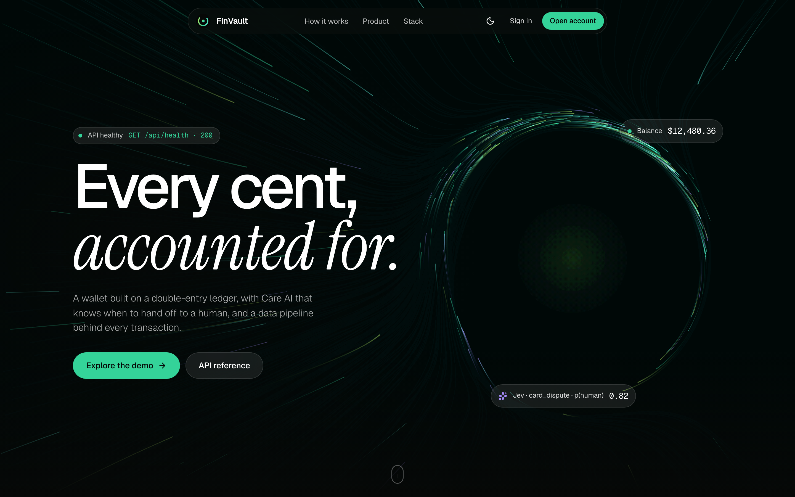
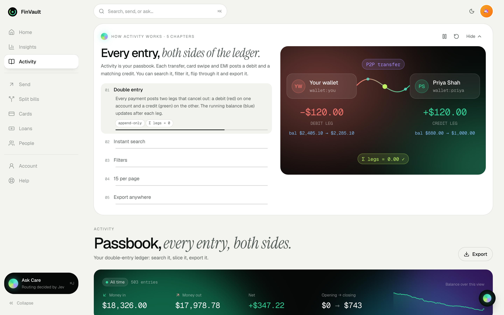
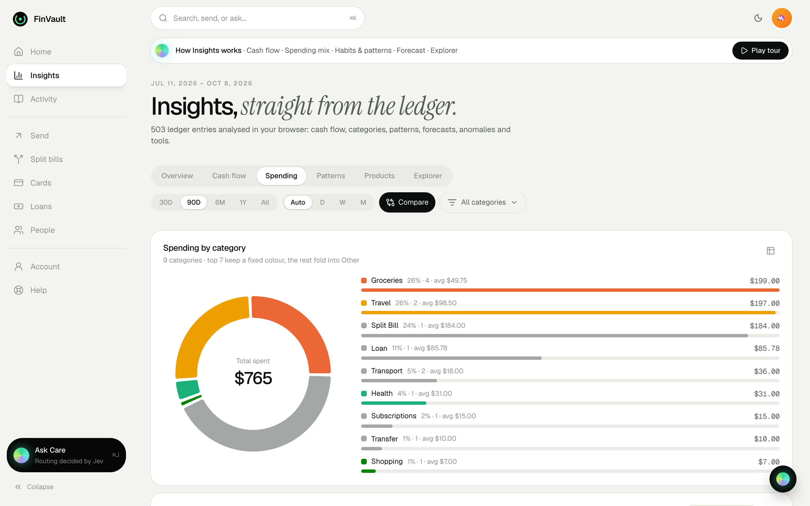
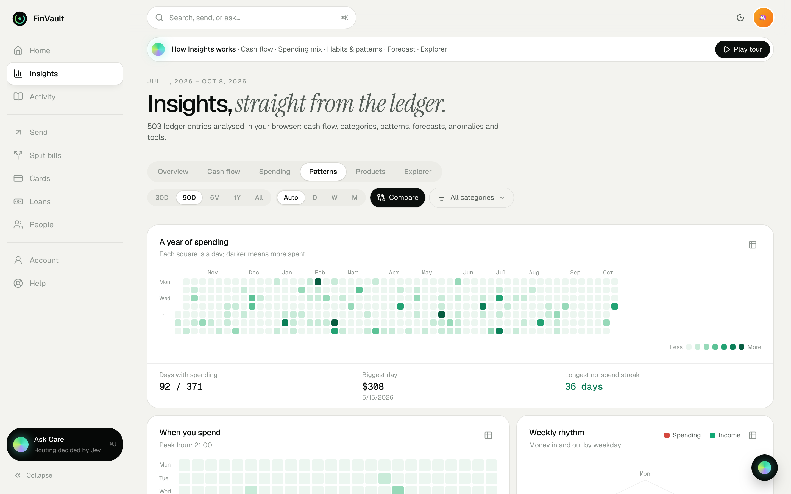
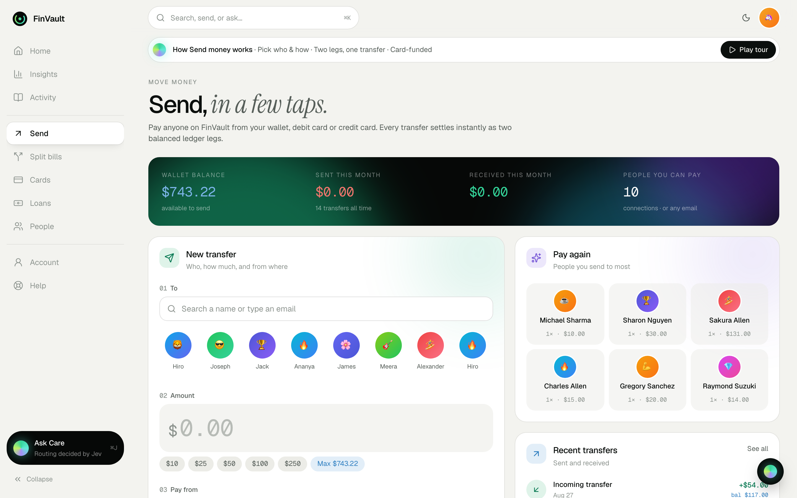
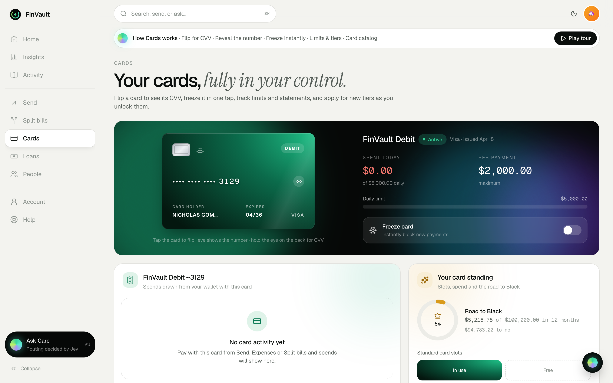
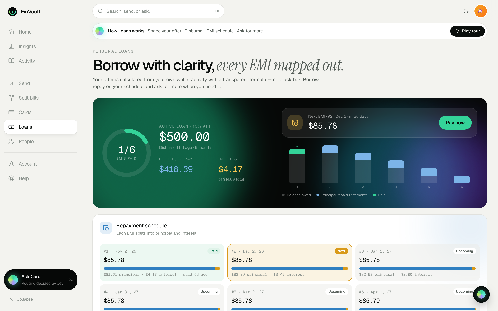
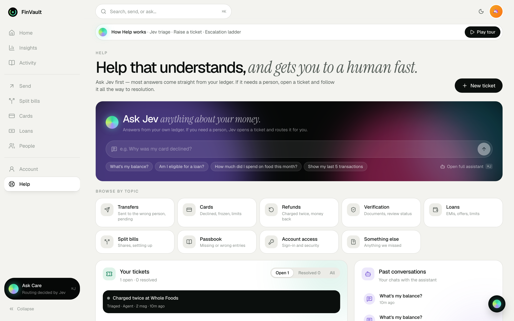
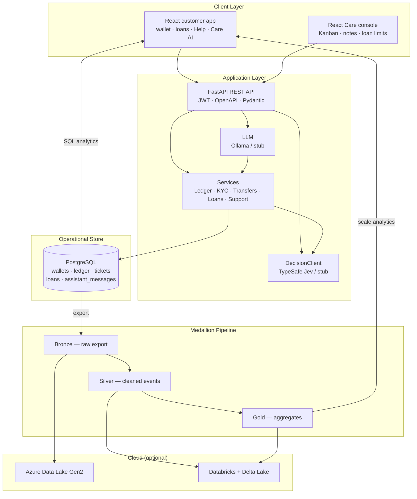
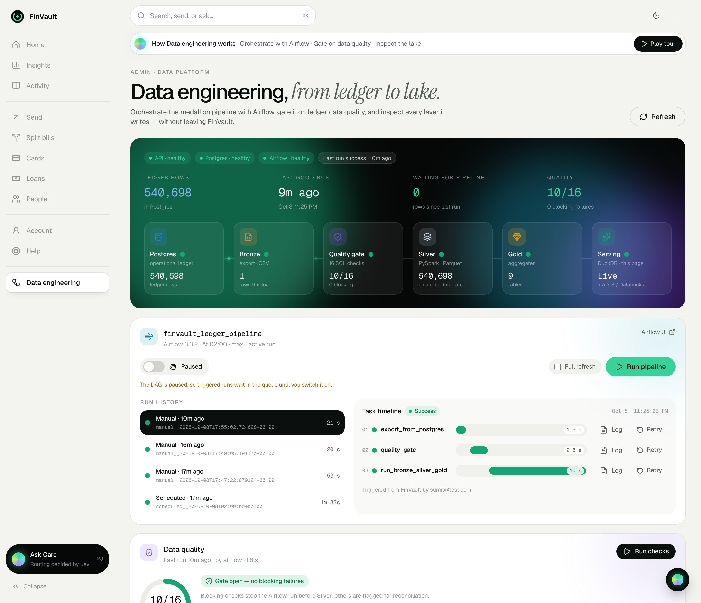

# FinVault Data Platform

**A production-style fintech wallet built in Python — paired with Customer Care AI (TypeSafe Jev + LLM) and a medallion data pipeline that takes the same financial events from app to cloud analytics.**

> Full-stack software engineering meets data engineering in one portfolio project: real money-movement semantics (ledger, KYC, P2P, cards, personal loans), an in-app Care assistant with System One triage, a support Kanban hierarchy, a modern React product UI, and Bronze → Silver → Gold processing with PySpark, Azure, and Delta Lake.

[](.github/workflows/ci.yml)
[](backend/)
[](frontend/)
[](docs/database.md)
[](docs/architecture/jev-decision-layer.md)
[](docs/data-pipeline.md)
[](data-pipeline/airflow_home/dags/finvault_pipeline_dag.py)

**Related:** Original Java/Spring Boot version — [developsumitkumar/FinVault](https://github.com/developsumitkumar/FinVault)

**Live demo:** Not deployed yet — run locally with Docker (see [Quick start](#quick-start-docker)) or follow [`docs/deployment.md`](docs/deployment.md) when you're ready to ship.

**Contributing:** See [CONTRIBUTING.md](CONTRIBUTING.md)

---

## Screenshots

<p align="center">
  
  <br />
  <em>A 40-second tour: landing → home → insights → passbook (page tour playing) → send → cards → loans → people → Ask Jev</em>
  <br />
  <sub><a href="docs/screenshots/finvault-tour.mp4">Watch the higher-quality MP4</a></sub>
</p>

<p align="center">
  
  <br />
  <em>Landing: "the ledger in motion" particle hero with live API health</em>
</p>

<p align="center">
  
  <br />
  <em>Page tours: every signed-in page opens with a chaptered motion explainer of what it does (hide it once and it stays folded)</em>
</p>

<p align="center">
  
  <br />
  <em>Home: vault balance panel, cards, 30-day stats and live ledger activity</em>
</p>

### Insights & passbook

<table>
  <tr>
    <td width="50%">
      
      <br />
      <sub><b>Insights · Overview</b>: balance forecast, KPIs, money-flow Sankey</sub>
    </td>
    <td width="50%">
      
      <br />
      <sub><b>Insights · Spending</b>: donut, category mix, treemap, movers</sub>
    </td>
  </tr>
  <tr>
    <td width="50%">
      
      <br />
      <sub><b>Insights · Patterns</b>: calendar and hour heatmaps, outliers, recurring payments</sub>
    </td>
    <td width="50%">
      
      <br />
      <sub><b>Passbook</b>: search, filter chips, 15 per page, PDF / Excel / CSV / JSON export</sub>
    </td>
  </tr>
</table>

### Move money

<table>
  <tr>
    <td width="50%">
      
      <br />
      <sub><b>Send</b>: pick anyone, big amount entry, wallet / debit / credit tiles with live limits, review → receipt</sub>
    </td>
    <td width="50%">
      
      <br />
      <sub><b>Split bills</b>: live share preview, email invites, progress rings, pay-your-share</sub>
    </td>
  </tr>
</table>

### Products

<table>
  <tr>
    <td width="50%">
      
      <br />
      <sub><b>Cards</b>: 3D flip card, freeze switch, limit meters, statements, road to Black, catalog</sub>
    </td>
    <td width="50%">
      
      <br />
      <sub><b>Loans</b>: EMI progress, balance chart, schedule, transparent offer formula, limit requests</sub>
    </td>
  </tr>
</table>

### People, account & help

<table>
  <tr>
    <td width="50%">
      
      <br />
      <sub><b>People</b>: requests inbox, network grid with Pay / Split shortcuts, discovery with notes</sub>
    </td>
    <td width="50%">
      
      <br />
      <sub><b>Account</b>: identity panel, avatar studio with drag-and-drop, KYC history, preferences</sub>
    </td>
  </tr>
  <tr>
    <td width="50%">
      
      <br />
      <sub><b>Help</b>: Ask Jev inline, topic tiles, tickets with escalation ladder</sub>
    </td>
    <td width="50%">
      
      <br />
      <sub><b>Auth</b>: flow-field split screen, customer and support portals</sub>
    </td>
  </tr>
</table>

<p align="center">
  
  <br />
  <em>Auto-generated API docs — full REST surface with try-it-out</em>
</p>

> To refresh screenshots after UI changes: `node scripts/capture-readme-screenshots.mjs` (see [docs/screenshots/README.md](docs/screenshots/README.md))

---

## Why this project exists

Most portfolio apps stop at CRUD. FinVault is designed to show **how fintech and data platforms work together in practice**:

| What recruiters care about | How FinVault demonstrates it |
|---|---|
| **Backend design** | Layered FastAPI (routes → services → repositories), Pydantic validation, Alembic migrations |
| **Financial correctness** | Append-only ledger, wallet row locking, atomic transfers, KYC-gated operations |
| **Product engineering** | Auth, onboarding, social connections, split bills, analytics, exports, admin workflows, Care AI + support Kanban |
| **Data engineering** | Medallion architecture, incremental + idempotent loading, Airflow orchestration, PySpark transforms, ADLS Gen2, Databricks + Delta Lake |
| **Decision systems** | TypeSafe Jev (System One triage) + local LLM for Care replies; deterministic loan math |
| **Engineering discipline** | Backend + pipeline tests, Docker Compose, CI, structured logging, deployment docs |

---

## System overview


```mermaid
flowchart TB
    subgraph Client["Client Layer"]
        UI["React customer app<br/>wallet · loans · Help · Care AI"]
        SUP["React Care console<br/>Kanban · notes · loan limits"]
    end

    subgraph API["Application Layer"]
        FAST["FastAPI REST API<br/>JWT · OpenAPI · Pydantic"]
        SVC["Services<br/>Ledger · KYC · Transfers · Loans · Support"]
        JEV["DecisionClient<br/>TypeSafe Jev / stub"]
        LLM["LLM<br/>Ollama / stub"]
    end

    subgraph Ops["Operational Store"]
        PG[("PostgreSQL<br/>wallets · ledger · tickets<br/>loans · assistant_messages")]
    end

    subgraph Pipeline["Medallion Pipeline"]
        BRZ["Bronze — raw export"]
        SLV["Silver — cleaned events"]
        GLD["Gold — aggregates"]
    end

    subgraph Cloud["Cloud (optional)"]
        ADLS["Azure Data Lake Gen2"]
        DBX["Databricks + Delta Lake"]
    end

    UI --> FAST
    SUP --> FAST
    FAST --> SVC --> PG
    FAST --> JEV
    FAST --> LLM
    SVC --> JEV
    LLM --> SVC
    PG -->|export| BRZ --> SLV --> GLD
    BRZ --> ADLS
    SLV --> DBX
    GLD --> DBX
    PG -->|SQL analytics| UI
    GLD -->|scale analytics| UI
```

**Data flow in one sentence:** users move money in the app → every event lands in an immutable ledger → Care AI / Jev triage support → exports feed Bronze/Silver/Gold → the same story is visible in real-time SQL dashboards and batch analytics at scale.

---

## Production data engineering practices

This isn't a happy-path pipeline demo — it's built and documented the way a real production pipeline gets hardened over time.

**Incremental & idempotent loading.** The export step tracks a watermark (last successfully processed timestamp) so every run only pulls new rows, not a full table scan. While building this, a real bug surfaced: skipping the Bronze file write when zero new rows arrived left a stale file on disk, which the next stage silently re-appended, duplicating data. Root-caused, fixed (always write Bronze, even empty, so "no new data" is represented truthfully), and verified with a three-run test (baseline → no-op run → run with exactly one new row). Full walkthrough: [`docs/data-pipeline-learning-notes.md`](docs/data-pipeline-learning-notes.md).

**Orchestration, not just a script.** The pipeline runs as an Apache Airflow DAG — `export → transform`, dependency-ordered, with automatic retries for transient failures and a failure callback that writes to `pipeline_failures.log` (stand-in for email / Slack). See [Airflow orchestration](#apache-airflow-orchestration) below for local runs and UI screenshots.

**Cloud-target architecture.** The medallion layers are designed to run unchanged locally and on Azure: ADLS Gen2 for storage, Databricks for managed Spark compute, and Delta Lake for the table format (ACID transactions, `MERGE`/upsert, time travel). The ADLS upload path, Delta table schemas, and Databricks job/notebook templates are implemented and documented — see [`docs/azure-storage.md`](docs/azure-storage.md) and [`docs/databricks.md`](docs/databricks.md). Cloud deployment against a live Azure subscription is the current next milestone.

---

## Apache Airflow orchestration

The DAG `finvault_ledger_pipeline` schedules the same modules you can run by hand — it does not reimplement pipeline logic:

1. **`export_from_postgres`** — watermarked incremental export from PostgreSQL → Bronze CSV (inclusive boundary, so late or same-timestamp rows are never skipped)
2. **`quality_gate`** — 16 SQL data-quality checks on the ledger; fails the run only on *blocking* checks (see below)
3. **`run_bronze_silver_gold`** — PySpark Bronze → Silver (idempotent append) → Gold; records timing and row counts in `pipeline_runs`

| Setting | Value |
|---|---|
| Schedule | `0 2 * * *` (daily 02:00 UTC) · `max_active_runs=1` (runs share one local lake) |
| Tasks | `export_from_postgres` → `quality_gate` → `run_bronze_silver_gold` |
| Run options | trigger conf `{"full_refresh": true}` ignores the watermark and rebuilds Silver |
| Retries | 2 per task (`retry_delay` 30s) + failure log callback |
| Lineage | every task gets `PIPELINE_RUN_ID={{ run_id }}`, so `pipeline_runs` / `data_quality_runs` rows link to the DAG run |
| DAG file | [`data-pipeline/airflow_home/dags/finvault_pipeline_dag.py`](data-pipeline/airflow_home/dags/finvault_pipeline_dag.py) |

### Data engineering console (admin)

Admins get a **Data engineering** page inside FinVault (`/data-engineering`, sidebar → Admin). The backend proxies Airflow's REST API (`/api/v2`), so the browser never sees Airflow credentials and customers get `403`.

<p align="center">
  
  <br />
  <em>Lineage coloured by the latest run, Airflow controls, run history and task timeline</em>
</p>

| Area | What it does |
|---|---|
| Status & freshness | API / Postgres / Airflow health, ledger rows, last good run, rows waiting for the pipeline |
| Lineage | Postgres → Bronze → quality gate → Silver → Gold → serving, with live row counts and task state |
| Airflow control | pause/schedule toggle, **Run pipeline** (optional full refresh), run history, per-run task timeline, live task logs, retry a task (clears it and everything downstream) |
| Data quality | 16 checks across validity, consistency, completeness, uniqueness and timeliness — double-entry legs net to zero, running-balance continuity, wallet ↔ ledger reconciliation, event/direction validity, card and loan integrity. Severity + `blocking` flag, failing-row samples, run history |
| Pipeline runs | duration chart and per-run counts (`Bronze in` vs `Silver new` shows idempotency at a glance) |
| Lakehouse | Bronze / Silver / Gold datasets with rows, size and freshness, read in place with **DuckDB**; preview any Gold table |

**Correctness guarantees (tested):** re-running a load or re-reading the watermark boundary adds **0** duplicate rows to Silver (left anti-join on `ledger_entry_id`); verified on 540,698 ledger rows — full refresh 17 s, incremental ~13 s.

**What the checks found in the demo data:** in-app transfers always balance, but 253 wallets show running-balance breaks and 259 wallets don't reconcile to their ledger — a side effect of the seed script that redistributes dates without recomputing `balance_after`. These are flagged (non-blocking) for reconciliation, which is exactly the trade-off a blocking/flagged split exists for.

Run the checks from a terminal too: `make quality` (or `python -m app.cli.data_quality --fail-on-blocking` from `backend/`).

### What we verified locally

*(Screenshots below are from the native Airflow UI, taken before the quality gate was added.)* Across scheduled, manual, and incremental triggers, every DAG run below finished **Success**. Export stays fast (~4s when only a few new ledger rows are pulled); Spark transforms typically finish in ~10–14s on this sample.

<p align="center">
  
  <br />
  <em>Runs — scheduled + manual DAG runs all Success; grid shows both tasks green across runs</em>
</p>

<table>
  <tr>
    <td width="50%">
      
      <br />
      <sub><b>export_from_postgres</b> — BashOperator · 0 failures · ~4s duration</sub>
    </td>
    <td width="50%">
      
      <br />
      <sub><b>run_bronze_silver_gold</b> — BashOperator · 0 failures · ~10–12s duration</sub>
    </td>
  </tr>
</table>

Retries are real, not decorative. Early attempts can fail when workers race or Spark is still warming up; Airflow re-queues the task and the next try succeeds — visible in the Task Tries strip and logs:

<table>
  <tr>
    <td width="50%">
      
      <br />
      <sub><b>Scheduled run</b> — Try 1 failed → Try 2 Success; row counts in Spark logs</sub>
    </td>
    <td width="50%">
      
      <br />
      <sub><b>Manual run</b> — recovered on Try 3; same Bronze → Silver → Gold path</sub>
    </td>
  </tr>
</table>

**Run types exercised**

| Run type | Example run id | What it proves |
|---|---|---|
| Scheduled | `scheduled__2026-10-02T02:00:00+00:00` | Cron schedule fires and completes end-to-end |
| Manual | `manual__…` | UI / CLI trigger works the same path as overnight |
| Incremental | `incremental__…` | After new ledger rows, export pulls only rows after the watermark (not a full table rescan) |
| Partial re-run | clear `run_bronze_silver_gold` only | Spark can be re-run without re-exporting Bronze |

### Run Airflow locally

```bash
# From repo root. Airflow 3.3 supports Python ≤ 3.13; use a 3.13 interpreter.
python3.13 -m venv .venv-airflow
.venv-airflow/bin/pip install "apache-airflow==3.3.2" --constraint "https://raw.githubusercontent.com/apache/airflow/constraints-3.3.2/constraints-3.13.txt"

# Pipeline venv (PySpark, Delta, Postgres driver) used by the DAG's tasks
python3.13 -m venv .venv && .venv/bin/pip install -r data-pipeline/requirements.txt

./scripts/airflow-standalone.sh   # UI → http://127.0.0.1:8080 · or `make airflow`
make dev                          # Postgres check + API + Airflow + frontend in one terminal
```

Login user is `admin`. The generated password is in  
`data-pipeline/airflow_home/simple_auth_manager_passwords.json.generated` (gitignored).

Unpause `finvault_ledger_pipeline`, or trigger a run from the UI / CLI:

```bash
airflow dags unpause finvault_ledger_pipeline
airflow dags trigger finvault_ledger_pipeline
```

More context: [`data-pipeline/airflow_home/README.md`](data-pipeline/airflow_home/README.md) · [`docs/data-pipeline-learning-notes.md`](docs/data-pipeline-learning-notes.md)

---

## Customer Care AI (TypeSafe Jev)

Showcase path: **System One decisions (Jev) for routing**, **deterministic code for money math**, **LLM only for grounded prose**.

Support triage uses **TypeSafe Jev** via OpenRouter’s Decisions API for sub-second structured answers — **category**, **urgency**, and **needs_human** — while a generative LLM (local **Ollama**, or a deterministic **stub** when Ollama is down) writes customer-facing replies. Personal loan eligibility and EMI are computed in services; the assistant explains them and routes limit disputes through a human hierarchy on a shared Kanban (**agent → manager → owner**). Help tickets never auto-skip the agent queue.

<p align="center">
  
  <br />
  <em>Care cinematic (animated) — request enters FinVault Care and flows through Jev</em>
</p>

<p align="center">
  
  <br />
  <em>Decision vs generation — Jev routes; services own balances/EMI; the LLM only narrates tool context</em>
</p>

<p align="center">
  
  <br />
  <em>Request path — DecisionClient (Jev or stub) → AI answer with tools, or human ticket on the Care Kanban</em>
</p>

<p align="center">
  <strong>▶ Demo video — TypeSafe Jev in FinVault Care</strong><br />
  <a href="docs/screenshots/jev.mp4">Watch <code>docs/screenshots/jev.mp4</code></a>
  <br />
  <em>Full walkthrough (MP4 opens from the repo — GitHub README does not autoplay video)</em>
</p>

| Layer | Role |
|---|---|
| **Jev** (`DecisionClient`) | Routes tickets & assistant handoffs — never invents balances or EMI |
| **Tools + SQL** | Wallet, ledger, cards, loans, limit-increase overrides |
| **LLM** | Prose + optional tables/charts/follow-ups grounded in tool data |
| **Care Kanban** | Sticky assign, escalate, private notes; managers/owners approve loan limit increases with audit |

**Local demo**

```bash
make seed-support          # 1 owner · 2 managers · 10 agents
make seed-support-tickets  # optional sample tickets
```

Login toggle on `/login` → **Support portal**. Env: `DECISION_PROVIDER=jev` + `OPENROUTER_API_KEY` for live Jev; without a key the app falls back to the stub (same interface). `LLM_PROVIDER=ollama` for freer chat wording.

Architecture: [`docs/architecture/jev-decision-layer.md`](docs/architecture/jev-decision-layer.md) · Spec: [`docs/features/customer-care-ai.md`](docs/features/customer-care-ai.md)

---

## Feature highlights

### Wallet & ledger
- Per-user wallet with **opening balance** on registration
- **Append-only ledger** — debits, credits, balance-after on every event
- Passbook with **category filters**, **date-range statements**, pagination, and **CSV / Excel / PDF export**
- Debit amounts styled for clarity; credits vs debits visually distinct

### Identity & compliance
- JWT authentication (register / login) with bcrypt password hashing
- **KYC document upload** (PDF, JPG, PNG) with admin approve / reject queue
- **Submission history** — rejected users can resubmit; prior records kept as audit trail
- Wallet operations gated until KYC is **APPROVED** (sender and receiver for transfers)

### Money movement
- **P2P transfers** by recipient email with dual ledger entries
- **External expense payments** with purpose and category
- **Split bills** — create group expenses, invite members, settle shares via ledger transfers
- Insufficient balance and KYC checks enforced server-side

### Customer Care & personal loans
- **Dual portals** — customer app vs Care console (role-gated login)
- **Support hierarchy** — 10 agents → 2 managers → 1 owner; sticky auto-assign; escalate with audit; handed-off tickets stay visible (view only); private staff notes
- **Jev triage** on every ticket and Care chat turn (category, urgency, `needs_human`) with stub fallback for CI/offline
- **In-app Care AI widget** — multi-turn, account-aware (balance, last N txs, category spend by month, cards, loans, transfers) + suggestion chips + “talk to an agent” handoff
- **Personal loans** — activity-based max / APR / EMI schedule; apply & pay EMI from wallet
- **Limit increases (Phase G)** — customer request → ticket auto-routed to manager → manager/owner approve/reject with audit; agents cannot invent a higher max in chat

### Social graph
- Connection requests (send, accept, reject, withdraw, unfriend)
- **User discovery search** by name or email
- Social-style connections UI with avatars, notes, and status pills

### Profile & avatars
- **Profile page** — edit name, phone, avatar
- **50 animated preset avatars** with even distribution across users
- Custom **JPG/PNG avatar upload**

### Insights (analytics)
- Six-tab **Insights** workspace computed from the full ledger: overview, cash flow, spending, patterns, products, explorer
- Balance **forecast** with a ±1σ band, money-flow **Sankey**, calendar and weekday × hour **heatmaps**, treemap, radar, histogram
- **Recurring-payment** and **2σ outlier** detection, month-to-date pace, runway gauge, card and loan analytics
- Tools: **what-if savings simulator**, goal planner, pivot table, searchable transaction explorer with CSV export
- Recharts with a validated, colour-blind-checked palette; every chart has a table view (`docs/design/design-system.md`)

### Interface ("Vault" design system)
- Public landing page with a canvas **particle flow field**, sticky scroll story (ledger → Jev → pipeline) and live API health
- Designed per aspect ratio: phone tab bar + sheets, landscape rail, tablet rail, desktop sidebar, ultrawide side rail
- ⌘K command palette, ⌘J Care assistant with visible **Jev triage**, light / dark themes, reduced-motion support

### Data platform
- **CSV bulk import** with validation, deduplication, and error reporting
- Local **PySpark** pipeline: Bronze → Silver → Gold, tested end-to-end
- **Incremental, idempotent loading** — watermark-based extraction; a real duplicate-row bug was found, root-caused, and fixed (see [`docs/data-pipeline-learning-notes.md`](docs/data-pipeline-learning-notes.md))
- **Apache Airflow orchestration** — scheduled + manual DAG runs, task retries, and failure logging (see [Airflow section](#apache-airflow-orchestration) with UI screenshots)
- **Ledger export** integrated into the medallion cycle (Phase 13)
- **Azure ADLS Gen2 + Databricks + Delta Lake** — storage upload, Delta table schemas, and job/notebook templates implemented and documented; live cloud deployment is the next step
- Data quality injection scripts for realistic pipeline testing

### Platform & ops
- **Docker Compose** full stack (Postgres + API + frontend)
- GitHub Actions CI (backend tests + frontend production build)
- Structured JSON logging and request IDs in production
- Deployment guide for Render (API) + Vercel (SPA)

---

## Technology stack

| Layer | Technologies |
|---|---|
| **Frontend** | React 19, TypeScript, Vite, Tailwind CSS v4, TanStack Query, React Hook Form, Zod, Recharts, Framer Motion, Lucide |
| **Backend** | Python 3.12, FastAPI, Pydantic v2, SQLAlchemy 2, Alembic, JWT, bcrypt |
| **Database** | PostgreSQL 15 (ACID, constraints, row-level locking on wallets) |
| **Decisions** | TypeSafe Jev via OpenRouter Decisions API (`DecisionClient` + local stub) |
| **Care LLM** | Ollama (local) or deterministic stub for CI / offline |
| **Data** | PySpark, Delta Lake, pandas, Azure Data Lake Storage Gen2, Databricks |
| **Orchestration** | Apache Airflow 3 (local standalone DAG: export → Bronze/Silver/Gold) |
| **Tooling** | Docker, Docker Compose, pytest, GitHub Actions, Makefile |
| **Design** | Custom fintech design system (`docs/design/design-system.md`) — light/dark theme toggle |

---

## Quick start (Docker)

The fastest way to run the full stack:

```bash
git clone https://github.com/developsumitkumar/finvault-data-platform.git
cd finvault-data-platform
cp .env.example .env
docker compose up --build
```

| URL | Description |
|---|---|
| http://localhost:3000 | React application |
| http://localhost:8000/docs | Interactive OpenAPI (Swagger) |
| http://localhost:8000/api/health | Health check |

### Demo accounts

**Customer portal** (`/login` → Customer)

| Account | Email | Password | Notes |
|---|---|---|---|
| **Admin** | `sumit@test.com` | `123456` | KYC approved · Admin KYC queue |
| **Seeded user** | `user0001@finvault.seed` | `password123456` | After `make seed-demo` |

Register a new user to walk through onboarding: wallet opens with a **$10,000** balance and an opening ledger entry.

**Support / Care portal** (`/login` → Support) — after `make seed-support`

| Role | Email | Password |
|---|---|---|
| **Owner** | `owner@finvault.support` | `SupportPass123!` |
| **Manager** | `manager01@finvault.support` | `SupportPass123!` |
| **Agent** | `agent01@finvault.support` … `agent10@…` | `SupportPass123!` |

Hierarchy: owner → manager01 (agents 01–05) / manager02 (agents 06–10). Use `/support/board` for the Kanban and `/support/loan-limits` for limit approvals.

### Rich demo dataset (optional)

Seed ~1,000 users with 5 years of ledger history, connections, and KYC variety:

```bash
make seed-demo          # full dataset
make seed-demo-small    # 10 users — quick smoke test
make backfill-avatars   # assign animated avatars to users missing one
```

---

## Local development (without Docker)

### Prerequisites

- PostgreSQL 15+
- Python 3.11+ (3.12 recommended)
- Node.js 20+
- Java 17+ (PySpark pipeline only)

### Backend

```bash
cp .env.example .env
# Start Postgres (Docker or local), then:

cd backend
python3 -m venv .venv && source .venv/bin/activate
pip install -r requirements.txt
alembic upgrade head
uvicorn app.main:app --reload --port 8000
```

### Frontend

```bash
cd frontend
npm install --legacy-peer-deps
npm run dev
```

App: http://localhost:5173 · API: http://localhost:8000/docs

### Data pipeline

```bash
export JAVA_HOME=$(/usr/libexec/java_home -v 19)   # macOS example
cd data-pipeline
python -m venv .venv && source .venv/bin/activate
pip install -r requirements.txt

python -m local.run_pipeline --export    # export DB → Bronze → Silver → Gold
python -m local.verify_ledger_cycle --fixture   # verify transforms (no DB)
```

To schedule the same pipeline with Airflow (UI on `:8080`), see [Apache Airflow orchestration](#apache-airflow-orchestration).

See [`docs/data-pipeline.md`](docs/data-pipeline.md) · [`docs/databricks.md`](docs/databricks.md) · [`docs/azure-storage.md`](docs/azure-storage.md)

---

## Testing & quality

```bash
make test              # backend + frontend
make test-backend      # pytest (PostgreSQL required)
make test-frontend     # TypeScript check + production build
make test-pipeline     # PySpark transform tests
make verify-ledger     # end-to-end ledger cycle (fixture mode)
```

| Suite | Coverage |
|---|---|
| Backend API | Auth, ledger, KYC, transfers, payments, connections, splits, imports, analytics, cards, support, loans, assistant, Jev stub |
| Frontend | `tsc` + Vite production build |
| Pipeline | Bronze/Silver/Gold transforms, ledger export cycle |
| CI | Runs on every push/PR to `main` |

---

## Repository structure

```
finvault-data-platform/
├── backend/                 # FastAPI application
│   ├── app/
│   │   ├── api/routes/      # REST endpoints
│   │   ├── services/        # Business logic
│   │   │   ├── decisions/   # Jev + stub DecisionClient
│   │   │   ├── assistant/   # Care AI tools, intent, chat
│   │   │   ├── llm/         # Ollama + stub reply clients
│   │   │   └── …            # ledger, KYC, transfers, loans, support
│   │   ├── repositories/    # Data access
│   │   ├── models/          # SQLAlchemy ORM
│   │   └── schemas/         # Pydantic request/response models
│   ├── alembic/             # Database migrations
│   ├── scripts/             # Seed data, support staff, data quality
│   └── tests/               # pytest suite
├── frontend/                # React SPA
│   └── src/
│       ├── pages/           # Customer app + support/ Care console
│       ├── components/      # UI + AssistantWidget
│       └── auth/            # Portal gates (customer vs support)
├── data-pipeline/           # Medallion pipeline
│   ├── local/               # PySpark runner, export, verify
│   ├── common/transforms/   # Shared Bronze/Silver/Gold logic
│   ├── airflow_home/        # Local Airflow DAG + config
│   └── databricks/          # Cloud job templates
├── docs/                    # Rules, design, architecture, phases (see docs/README.md)
│   ├── architecture/        # Jev decision-layer diagrams
│   ├── features/            # Cards, customer-care-ai
│   ├── design/              # Design system + UI direction
│   └── rules/               # AI_RULES, Cursor workflow
├── infra/azure/             # Azure infrastructure notes
├── PROJECT_PLAN.md          # Phase roadmap and deliverables
├── docker-compose.yml
└── Makefile
```

---

## API surface (selected)

| Area | Endpoints |
|---|---|
| Auth | `POST /api/auth/register`, `POST /api/auth/login` (customer / support portal) |
| Profile | `GET/PUT /api/user/profile`, `GET /api/user/search`, avatar upload/preset |
| Ledger | `GET /api/ledger/passbook`, `/summary`, `/category`, `/monthly`, `/monthly-flow` |
| KYC | `POST /api/kyc/submit`, `GET /api/kyc/status`, `GET /api/kyc/history` |
| Transfers | `POST /api/transfer/send` |
| Payments | `POST /api/payments/initiate`, `GET /api/payments/my` |
| Connections | `POST /api/connections/request`, `GET /api/connections/my`, accept/reject/… |
| Split bills | `POST /api/split-bills`, `GET /api/split-bills/my`, settle |
| Cards | Catalog + issue / freeze / billing surfaces under `/api/cards` |
| Loans | `GET /api/loans/offer`, apply, pay EMI, `POST /api/loans/limit-requests` |
| Help tickets | `POST /api/tickets`, list/detail/messages (customer) |
| Care AI | `POST /api/assistant/chat`, sessions |
| Support | `/api/support/board`, escalate, notes, `/api/support/loan-limit-requests` |
| Admin | `GET /api/admin/kyc/pending`, approve, reject |
| Import | `POST /api/imports/preview`, confirm |

Full interactive docs at `/docs` when the API is running.

---

## Development phases

Built incrementally across **15 phases** — each scoped, tested, and documented before moving on.

| Phase | Focus | Status |
|---:|---|:---:|
| 0–2 | Foundation, ingestion, data quality | ✅ |
| 3 | Local PySpark pipeline (Bronze/Silver/Gold) | ✅ |
| 4–5 | Azure ADLS Gen2 + Databricks + Delta Lake integration | ✅ Implemented · deployment pending |
| 6 | Auth & users (JWT, roles, protected routes) | ✅ |
| 7 | Wallet & ledger (append-only audit trail) | ✅ |
| 8 | KYC & admin approval workflow | ✅ |
| 9 | P2P transfers & expense payments | ✅ |
| 10 | Connections & split bills | ✅ |
| 11 | Modern React frontend | ✅ |
| 12 | Analytics layer (SQL + charts) | ✅ |
| 13 | Pipeline reconnect (ledger → Bronze → Gold) | ✅ |
| 14 | Docker, CI, deployment polish | ✅ |
| 15 | UI reskin, passbook export, analytics upgrade, profile & avatars | 🔄 |
| 16 | Payment cards (debit / credit / Black Card) | ✅ |
| 17 | Incremental loading, idempotency fix, Airflow orchestration | ✅ |
| Care A–D | Support roles, Kanban, Jev triage, escalate hierarchy | ✅ |
| Care E–F | Personal loans + customer Care AI widget | ✅ |
| Care G | Loan limit-increase approvals + README / Jev portfolio story | ✅ |

Details: [`PROJECT_PLAN.md`](PROJECT_PLAN.md) · Care spec: [`docs/features/customer-care-ai.md`](docs/features/customer-care-ai.md) · Phase briefs: [`docs/phases/`](docs/phases/)

---

## Architecture principles

1. **Ledger as source of truth** — balances are derived from immutable entries, not ad-hoc updates.
2. **Transactional integrity** — wallet debits use row locks inside a single DB transaction.
3. **Separation of concerns** — routes never query the DB; services own business rules.
4. **Decisions ≠ generation** — Jev/stub owns triage routing; the LLM only narrates tool-grounded facts; loan EMI stays in deterministic code.
5. **Medallion for scale** — operational Postgres for real-time; Gold tables for heavy analytics.
6. **Same transforms everywhere** — `data-pipeline/common/transforms/` runs locally and on Databricks.

Deep dive: [`docs/architecture.md`](docs/architecture.md) · Jev: [`docs/architecture/jev-decision-layer.md`](docs/architecture/jev-decision-layer.md) · Schema: [`docs/database.md`](docs/database.md)

---

## Interview narrative

> *"I rebuilt my FinVault wallet platform in Python with FastAPI and PostgreSQL, using an append-only ledger for every financial event — KYC, transfers, expenses, cards, and personal loans. On top of that I built Customer Care: TypeSafe Jev does System One triage (category, urgency, needs-human) while a local LLM writes grounded answers from account tools, and a support Kanban escalates agent → manager → owner — including audited loan limit-increase approvals. The React frontend covers the full product surface plus a Care console. The same operational data feeds a Bronze/Silver/Gold pipeline with watermark-based incremental loading, orchestrated by Apache Airflow — I found and fixed a real duplicate-row idempotency bug while building it. The pipeline targets Delta Lake on Azure Databricks, with ADLS/Databricks integration implemented and cloud deployment as the next milestone — so I can speak to application engineering, decision systems, and production-minded data platforms from one codebase."*

---

## Documentation index

Start at [`docs/README.md`](docs/README.md).

| Document | Contents |
|---|---|
| [`docs/deployment.md`](docs/deployment.md) | Docker, Render, Vercel |
| [`docs/architecture.md`](docs/architecture.md) | System design & layering |
| [`docs/architecture/jev-decision-layer.md`](docs/architecture/jev-decision-layer.md) | **Jev** DecisionClient, call sites, fallbacks |
| [`docs/features/customer-care-ai.md`](docs/features/customer-care-ai.md) | Care AI + support + loans spec (phases A–G) |
| [`docs/database.md`](docs/database.md) | PostgreSQL schema |
| [`docs/reference/java-port-reference.md`](docs/reference/java-port-reference.md) | Java → Python port mapping |
| [`docs/data-pipeline.md`](docs/data-pipeline.md) | Local PySpark pipeline |
| [`docs/data-pipeline-learning-notes.md`](docs/data-pipeline-learning-notes.md) | Incremental loading, idempotency, Airflow |
| [`docs/data-quality.md`](docs/data-quality.md) | CSV validation rules |
| [`docs/azure-storage.md`](docs/azure-storage.md) | ADLS Gen2 integration |
| [`docs/databricks.md`](docs/databricks.md) | Databricks jobs & Delta |
| [`docs/design/design-system.md`](docs/design/design-system.md) | Frontend design system |
| [`docs/features/cards.md`](docs/features/cards.md) | Payment cards spec |
| [`docs/rules/AI_RULES.md`](docs/rules/AI_RULES.md) | AI / coding rules |
| [`CONTRIBUTING.md`](CONTRIBUTING.md) | Setup, workflow, PR checklist |

---

## Author

**Sumit Kumar** — [GitHub @developsumitkumar](https://github.com/developsumitkumar)

This project extends the original [Java FinVault](https://github.com/developsumitkumar/FinVault) into a Python full-stack + data engineering portfolio piece. If you're reviewing this for a role, the README, `PROJECT_PLAN.md`, and `docs/` folder are intended to make the scope and trade-offs easy to evaluate.

Interested in contributing? See [CONTRIBUTING.md](CONTRIBUTING.md).

---

## License

This project is provided for portfolio and educational purposes. Contact the author for other use.
