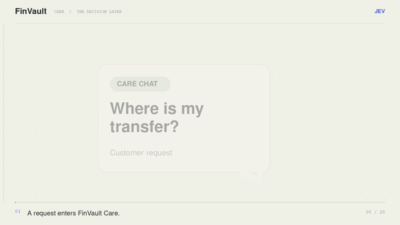
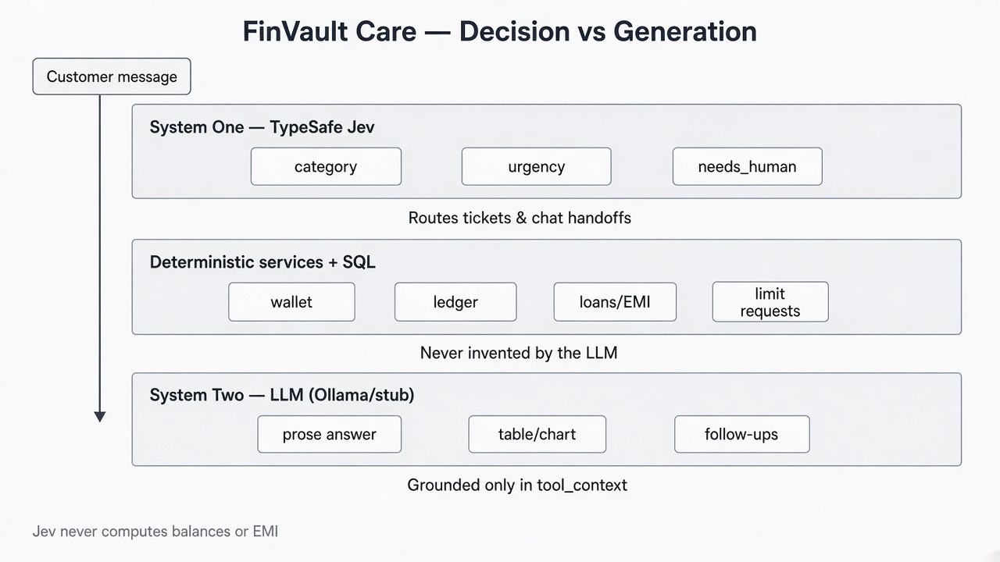
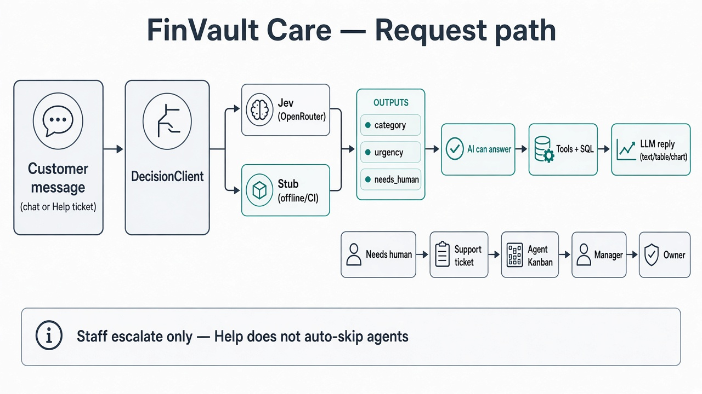

FINVAULT · PRODUCT × DECISIONS × DATA

# Before the Answer: Jev’s Role in FinVault

**A wallet, a Care assistant, and a data platform built around one question: who should decide what happens next?**

*By [Sumit Kumar](https://github.com/developsumitkumar) · A look inside [FinVault Data Platform](https://github.com/developsumitkumar/finvault-data-platform)*

---

“Where is my transfer?” looks like a chat prompt. Inside a financial product, it is also a routing problem. The system needs account facts, a useful answer, and a way to recognize when a person should take over.

That is where **TypeSafe Jev** enters FinVault.

Jev is the external **System One decision layer** behind FinVault’s Customer Care: it classifies the request, assesses urgency, and returns a probability that human support is needed. A separate generative model writes the response. SQL and application services supply the financial facts.

The division sounds small. It shapes the entire product.

  
   
  Inside Care: a customer message becomes a decision, an answer, or a human handoff. <a href="docs/screenshots/jev.mp4">Watch the full walkthrough →</a>

## Give the decision its own layer

FinVault calls Jev through OpenRouter’s Decisions API, behind a `DecisionClient` interface. Every support ticket and Care chat turn goes through triage for **category**, **urgency**, and **`needs_human`**. Ticket records retain confidence and provider output; chat turns retain triage context alongside the conversation.

A local intent router has a separate job: identifying which account tools to gather, such as balance, spending, or loan information. Jev handles support triage. The **System Two LLM**, running locally through Ollama or as a deterministic stub, turns tool results into customer-facing prose, with optional tables, charts, and follow-ups.

> **Jev decides the support route. Services own the money facts. The language model explains them.**

That boundary keeps balances, eligibility, and EMI calculations in deterministic code. The assistant can explain an offer; authority to raise a loan limit belongs to the approval workflow.

  

The integration also has a practical fallback. A local decision stub implements the same interface for offline work and CI. Missing credentials select the stub; the documented support-service fallback also handles HTTP or parsing failures. The reply layer has its own deterministic stub. Developers can exercise the Care workflow without depending on both external decisions and local model availability.

## Why put Jev inside a financial product?

FinVault’s motivation is to connect application engineering, decision systems, and data engineering in one inspectable project. Extending the original Java/Spring Boot FinVault into Python creates room to follow a financial event across the entire stack: customer action, ledger entry, support conversation, and analytical dataset.

The product gives those architectural choices something concrete to serve.

A new account receives a **$10,000 demo opening balance** and its opening ledger entry. JWT authentication and bcrypt protect sign-in; KYC submission, review, rejection, and resubmission introduce an approval lifecycle. Wallet operations require approved KYC, including both participants in a transfer.

P2P transfers use recipient email, atomic database transactions, wallet row locking, and paired ledger entries. Expense payments carry a purpose and category. Group bills become individual shares that settle through ledger transfers. Server-side checks enforce balance and KYC requirements.

  
   
  The customer surface: wallet, compliance status, actions, and recent activity in one view.

The append-only ledger ties it together. Each debit or credit records its balance afterward, giving the passbook, account tools, and downstream pipeline a shared financial history.

## When Care becomes a human conversation

The in-app assistant supports multi-turn, account-aware conversations about balances, recent transactions, monthly category spending, cards, loans, and transfers. Suggestion chips help customers start; “talk to an agent” provides an explicit handoff. A human request or triage threshold can create a ticket.

From there, responsibility is visible. Separate, role-gated customer and support portals lead to a shared Care Kanban with sticky assignment, private staff notes, audited escalation, and view-only visibility after handoff. The seeded hierarchy contains **10 agents, two managers, and one owner**.

Ordinary Help tickets begin in the agent queue. Moving them to manager or owner is a staff action.

**Loan limit-increase requests have a dedicated path:** the customer’s request is routed to a manager, and a manager or owner approves or rejects it with an audit trail. Meanwhile, services compute activity-based loan limits, APR, and EMI schedules; customers can apply and repay EMIs from their wallet.

  
   
  The general Care path. Loan limit requests use the dedicated manager approval workflow described above.

## One ledger, two views of the business

Customers see SQL-powered analytics: balance trends, category spending, monthly activity, income versus expense, and summary cards with sparklines. The data platform follows the same operational events into **Bronze → Silver → Gold** through PySpark.

Watermarked extraction pulls new rows incrementally. One documented bug captures the value of building this end to end: when an empty export skipped writing Bronze, a stale file remained and was appended again downstream. The fix always writes Bronze—even when empty—and was checked with a baseline run, a no-op run, and a run containing exactly one new row.

Apache Airflow schedules export followed by transformation at **02:00 UTC daily**, with two retries per task and a failure-log callback. Local evidence covers scheduled, manual, incremental, and partial reruns, including recovery after failed attempts.

<table>
  <tr>
    <td width="50%"> <b>Product view</b> — account history becomes useful feedback.</td>
    <td width="50%"> <b>Pipeline view</b> — the same events move through scheduled processing.</td>
  </tr>
</table>

The Azure path is implemented and documented: ADLS Gen2 uploads, Delta table schemas, and Databricks job/notebook templates, using shared transformation code. **Deployment against a live Azure subscription remains the next milestone.**

## The rest of the product, at a glance

<strong>Open the complete feature index</strong>

Beyond the wallet, Jev, Care, loans, and pipeline described above:

| Surface | What is included |
|---|---|
| **Passbook** | Category and date-range filters, pagination, distinct credit/debit styling, and CSV, Excel, and PDF exports. |
| **KYC administration** | PDF/JPG/PNG document upload, admin approve/reject queue, retained submission history, and resubmission after rejection. |
| **Help and conversation history** | Customer ticket lists, ticket details and message threads, plus saved assistant sessions. |
| **Payment cards** | Debit, credit, and Black Card offerings; catalog, issuance, freezing, and billing surfaces. |
| **Connections** | Name/email discovery; send, accept, reject, or withdraw requests; unfriend; avatars, notes, and status indicators. |
| **Split bills** | Multi-step group-expense creation, member invitations, share settlement, and progress tracking. |
| **Profile and design** | Editable name, phone, and avatar; 50 animated presets with distributed assignment; custom JPG/PNG uploads; light/dark themes, motion, and a consistent chart design system. |
| **Imports and data quality** | CSV preview/confirmation, validation, deduplication, error reporting, and data-quality injection scripts. |
| **Demo data** | A small seed or roughly 1,000 users with five years of ledger history, connections, varied KYC states, avatar backfill, and optional support tickets. |
| **Developer experience** | Interactive OpenAPI docs, health endpoint, Alembic migrations, Makefile commands, and Docker Compose for PostgreSQL, API, and frontend. |
| **Verification and operations** | Backend API tests, pipeline transform and ledger-cycle checks, TypeScript checks and production builds, GitHub Actions, structured JSON logs, and request IDs. Render/Vercel deployment guides are provided. |

## Built to inspect—and run

The stack brings together **React 19 and TypeScript**, **FastAPI and PostgreSQL**, **Jev and Ollama**, and **PySpark and Airflow**. Layered routes, services, and repositories make the boundaries visible in code.

FinVault is a portfolio and educational project, with local execution available through Docker; a public live demo is not yet deployed. Its strongest story is already concrete: **Jev makes a bounded decision inside a working product, people retain approval authority, and the ledger carries the evidence from wallet to analytics.**

**[Explore the repository](https://github.com/developsumitkumar/finvault-data-platform)** · [Run it locally](README.md#quick-start-docker) · [Read the Jev architecture](docs/architecture/jev-decision-layer.md) · [Follow the pipeline investigation](docs/data-pipeline-learning-notes.md)
