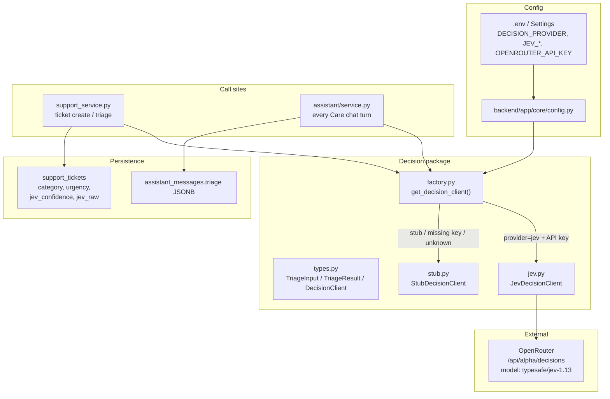
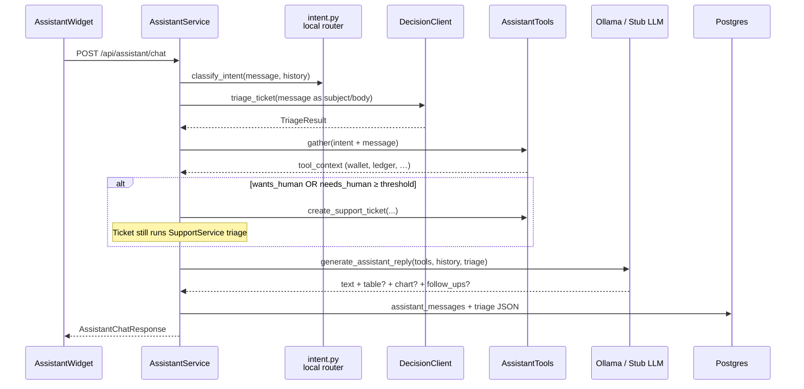
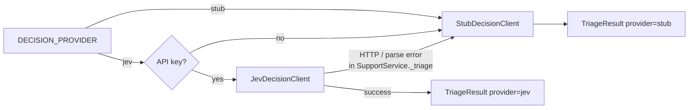

# Jev decision-layer architecture (FinVault Care)

This document describes **how TypeSafe Jev is wired into FinVault** — not Jev’s internal model training.  
Jev is an external **System One** decision API (via OpenRouter). FinVault owns the client, schema, call sites, persistence, and fallbacks.

Companion feature spec: [`../features/customer-care-ai.md`](../features/customer-care-ai.md).

Portfolio diagrams / video (also in README):

- [`../screenshots/jev-decision-vs-generation.jpg`](../screenshots/jev-decision-vs-generation.jpg) — Decision vs generation layers  
- [`../screenshots/jev-request-path.jpg`](../screenshots/jev-request-path.jpg) — Request path through DecisionClient  
- [`../screenshots/jev-cinematic.gif`](../screenshots/jev-cinematic.gif) — Animated Care / Jev cinematic (README inline)  
- [`../screenshots/jev.mp4`](../screenshots/jev.mp4) — Full demo video  

---

## 1. Principle

| Layer | Owns | Does **not** own |
|---|---|---|
| **Jev / stub (`DecisionClient`)** | Category, urgency, `needs_human` probability | Balances, EMI math, chat prose, Kanban escalation |
| **Tools + SQL** | Wallet, ledger, cards, loans, tickets | Routing policy |
| **LLM (Ollama / stub)** | Customer-facing text + optional table/chart/follow-ups | Whether a human is required |
| **Support hierarchy** | Agent → manager → owner escalate (staff actions) | Auto-escalate from Help form |

**Rule:** the generative LLM never decides routing. Jev (or the local stub) does.

---

## 2. Component map (repo paths)



| Path | Role |
|---|---|
| `backend/app/services/decisions/types.py` | Protocol + `TriageInput` / `TriageResult` |
| `backend/app/services/decisions/jev.py` | HTTP client to OpenRouter Decisions API |
| `backend/app/services/decisions/stub.py` | Keyword heuristics (same outputs) |
| `backend/app/services/decisions/factory.py` | Provider selection + key fallback |
| `backend/app/services/support_service.py` | Ticket triage + store `jev_*` |
| `backend/app/services/assistant/service.py` | Chat triage + human-handoff gate |
| `backend/alembic/versions/013_support_tickets.py` | `jev_confidence`, `jev_raw` columns |
| `backend/tests/test_decisions.py` | Stub contract tests |

---

## 3. Request → decision → action

### 3a. Support ticket path

```mermaid
sequenceDiagram
  participant U as Customer / Help UI
  participant API as FastAPI tickets routes
  participant SS as SupportService
  participant DC as DecisionClient<br/>Jev or Stub
  participant OR as OpenRouter Jev
  participant DB as Postgres

  U->>API: Create ticket (subject, body, category?)
  API->>SS: create_ticket(user, payload)
  SS->>DC: triage_ticket(TriageInput)
  alt DECISION_PROVIDER=jev and API key present
    DC->>OR: POST decisions {state, questions}
    OR-->>DC: answers.category / urgency / needs_human
  else stub or no key or HTTP error
    DC-->>SS: StubDecisionClient heuristics
  end
  DC-->>SS: TriageResult
  SS->>DB: INSERT support_tickets<br/>category, urgency, jev_confidence, jev_raw
  SS->>DB: Auto-assign agent (separate from Jev)
  Note over SS,DB: needs_human is stored/signaling;<br/>Help does NOT auto-escalate Kanban
```

### 3b. Customer AI assistant path



**Split of concerns on chat:**

- **Local `intent.py`** — fast UX routing (balance vs spend vs loan) for tool gathering  
- **Jev/stub** — support taxonomy + human probability (portfolio showcase)  
- **LLM** — wording only, grounded in `tool_context`

---

## 4. Jev API contract (what we send)

Built in `JevDecisionClient.triage_ticket()`:

```text
POST {JEV_BASE_URL}
Authorization: Bearer {OPENROUTER_API_KEY|JEV_API_KEY}

{
  "model": "typesafe/jev-1.13",
  "state": {
    "subject": "...",
    "ticket": "...",
    "product": "FinVault wallet / ledger / cards / KYC / personal loans",
    "customer_selected_category": "...?",
    "customer_kyc_status": "APPROVED|..."
  },
  "questions": {
    "category":    { "type": "choice", "criteria": { refund, kyc, transfer, ... } },
    "urgency":     { "type": "choice", "criteria": { low, medium, high, critical } },
    "needs_human": { "type": "noul",   "criteria": { true, false } }
  }
}
```

Mapped into:

```text
TriageResult(
  category, urgency,
  needs_human: float 0..1,
  category_confidence: float,
  provider: "jev"|"stub",
  model, raw
)
```

`should_escalate(threshold)` → `needs_human >= JEV_NEEDS_HUMAN_THRESHOLD` (default `0.65`).

---

## 5. Fallback ladder



CI sets `DECISION_PROVIDER=stub` (see `backend/tests/conftest.py`).

---

## 6. Data stored from Jev

On `support_tickets` (migration `013_support_tickets.py`):

| Column | Meaning |
|---|---|
| `category` | Chosen support category |
| `urgency` | Chosen urgency |
| `jev_confidence` | Category confidence |
| `jev_raw` | Provider/model + truncated answers (audit) |

On assistant turns: `assistant_messages.triage` JSON includes Jev fields **plus** local `intent` / `intent_entities`.

---

## 7. End-to-end Care path (portfolio story)

```text
Customer asks in AI widget
        │
        ├─► Local intent (tools)
        ├─► Jev triage (category / urgency / needs_human)
        │
        ├─► AI can answer ──► tools ──► LLM/stub reply (+ chips)
        │
        └─► Human needed ──► create ticket ──► Jev fields on ticket
                              ──► assign SUPPORT_AGENT
                              ──► Kanban: agent → manager → owner
                                  (staff escalate only)
```

---

## 8. Env checklist

```bash
DECISION_PROVIDER=jev
OPENROUTER_API_KEY=sk-or-...   # or JEV_API_KEY=
JEV_MODEL=typesafe/jev-1.13
JEV_BASE_URL=https://openrouter.ai/api/alpha/decisions
JEV_NEEDS_HUMAN_THRESHOLD=0.65
JEV_TIMEOUT_SECONDS=20
```

Without a key, logs will show fallback to stub even if `DECISION_PROVIDER=jev`.

---

## 9. Out of scope (intentionally)

- Jev does not write ticket replies or assistant prose  
- Jev does not compute loan EMI / max principal  
- Help form does not auto-escalate to manager/owner based on Jev alone  
- No RAG over docs yet — curated KB snippets only for the LLM  

Phase G is shipped: `loan_limit_requests` + Care `/support/loan-limits` (manager/owner approve). Keep any future loan-topic Jev questions on `DecisionClient`, not in the LLM.
